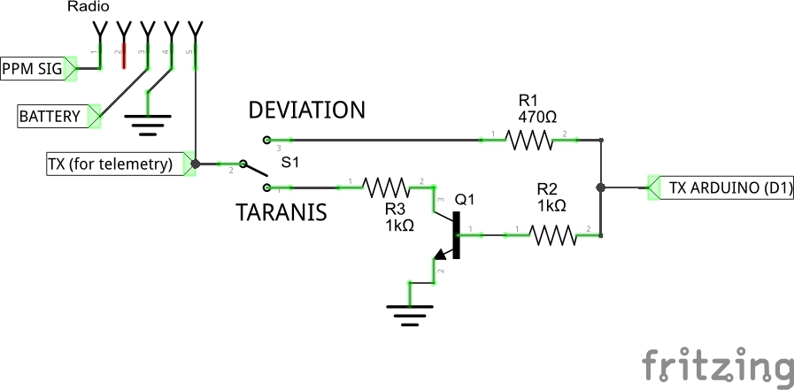

# DIY-Multiprotocol-TX-Module

 

Fork du projet https://github.com/pascallanger/DIY-Multiprotocol-TX-Module

Afin d'ajouter :
- Une sélection du protocole via les manches de la radio
- Un rebind hardware en PPM
- La radio TARANIS (TAERB, B = rebind ;-) ) et redéclaration des radios
- Un script "LUA" afin de faciliter la position des manches

Programme des évolutions :
- Ajout du de la télémetrie TARANIS à l'aide du projet https://github.com/shadow974/TxAdapter

	(Attention, il faut rajouter un transistor afin d'inverser et amplifier le signal)

#Schematic

Notes:
- Attention: All modules are 3.3V only, never power them with 5V.
- For serial, the dial switch is not needed and the bind button optionnal
- Ajout d'un switch + transistor sur le TX

#Protocoles ajoutés mais non testés (Issue de Deviation)
##CYRF6936 RF Module
###J6PRO
CH1|CH2|CH3|CH4|CH5|CH6|CH7|CH8|CH9|CH10|CH11|CH12
---|---|---|---|---|---|---|---|---|---|---|---
CH1|CH2|CH3|CH4|CH5|CH6|CH7|CH8|CH9|CH10|CH11|CH12

###WK2x01
En cours ...

##A7105 RF Module
###Joysway
CH1|CH2|CH3|CH4
---|---|---|---
A|E|T|R

##NRF24L01 RF Module
###CFLIE
Modele: CrazyFlie Nano quad
CH1|CH2|CH3|CH4
---|---|---|---
A|E|T|R

###Fy326
Autobind
CH1|CH2|CH3|CH4|CH5|CH6|CH7|CH8
---|---|---|---|---|---|---|---
A|E|T|R|FLIP|HEADLESS|RTH|Calibrate

###H377
CH1|CH2|CH3|CH4|CH5|CH6|CH7|CH8
---|---|---|---|---|---|---|---
A|E|T|R|CH5|CH6|CH7|CH8

###HM830
Modele: HM Hobby HM830 RC Paper Airplane
CH1|CH2|CH3|CH4|CH5
---|---|---|---
A|Turbo|T|Trim|Bouton ???

