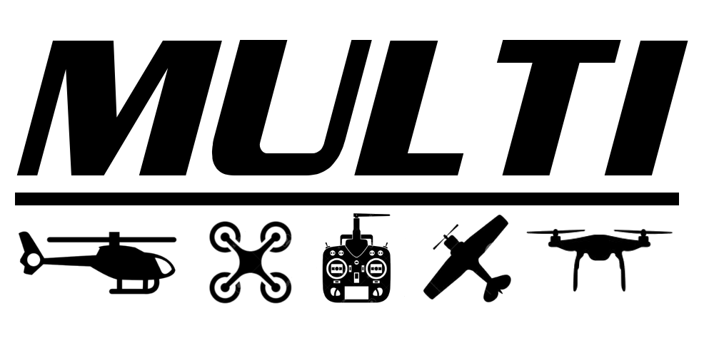
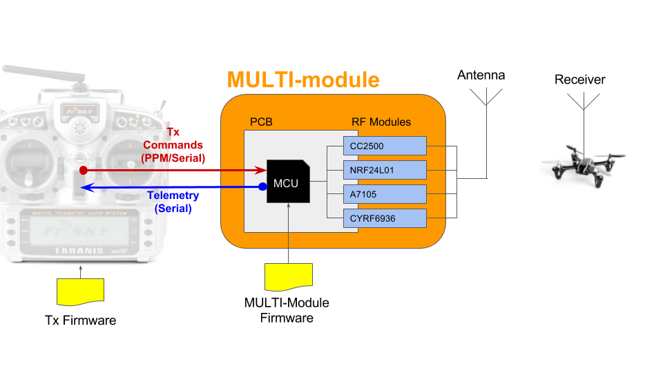

# Multiprotocol TX Module


The **Multiprotocol Tx Module** (or **MULTI-Module**) is a 2.4GHz transmitter module which enables almost any transmitter to control many different receivers and models, including many popular helicopters, planes, quadcopters, and miniquads.

The main forum for protocol requests and questions is on [RCGroups.com](https://www.rcgroups.com/forums/showthread.php?2165676-DIY-Multiprotocol-TX-Module/page10000).

If you like this project and want to support further development please consider making a [donation](docs/Donations.md).  

<table cellspacing=0>
  <tr>
    <td align=center width=200><a href="https://www.paypal.com/cgi-bin/webscr?cmd=_donations&business=VF2K9T23DRY56&lc=US&item_name=DIY%20Multiprotocol&currency_code=EUR&amount=5&bn=PP%2dDonationsBF%3abtn_donate_SM%2egif%3aNonHosted"></a><br><b>€5</b></td>
    <td align=center width=200><a href="https://www.paypal.com/cgi-bin/webscr?cmd=_donations&business=VF2K9T23DRY56&lc=US&item_name=DIY%20Multiprotocol&currency_code=EUR&amount=10&bn=PP%2dDonationsBF%3abtn_donate_SM%2egif%3aNonHosted"></a><br><b>€10</b></td>
    <td align=center width=200><a href="https://www.paypal.com/cgi-bin/webscr?cmd=_donations&business=VF2K9T23DRY56&lc=US&item_name=DIY%20Multiprotocol&currency_code=EUR&amount=15&bn=PP%2dDonationsBF%3abtn_donate_SM%2egif%3aNonHosted"></a><br><b>€15</b></td>
    <td align=center width=200><a href="https://www.paypal.com/cgi-bin/webscr?cmd=_donations&business=VF2K9T23DRY56&lc=US&item_name=DIY%20Multiprotocol&currency_code=EUR&amount=25&bn=PP%2dDonationsBF%3abtn_donate_SM%2egif%3aNonHosted"></a><br><b>€25</b></td>
    <td align=center width=200><a href="https://www.paypal.com/cgi-bin/webscr?cmd=_donations&business=VF2K9T23DRY56&lc=US&item_name=DIY%20Multiprotocol&currency_code=EUR&bn=PP%2dDonationsBF%3abtn_donate_SM%2egif%3aNonHosted"></a><br><b>Other</b></td>
  </tr>
</table>

## Development status

Multiprotocol downloads: 

Current Multiprotocol code check status: [](https://github.com/pascallanger/DIY-Multiprotocol-TX-Module/actions). Download the latest **test** build [here](https://downloads.multi-module.org/latest-test/).

Current Multiprotocol boards check status: [](https://travis-ci.com/pascallanger/DIY-Multiprotocol-TX-Module-Boards)

## Quicklinks
* [Download latest releases of the firmware](https://github.com/pascallanger/DIY-Multiprotocol-TX-Module/releases) and [instructions to upload .hex files](docs/Advanced_Manually_Setting_ATmega328_Fuses.md)
* [Forum on rcgroups](http://www.rcgroups.com/forums/showthread.php?t=2165676)
* [Available Protocols list](Protocols_Details.md)
* [The old documentation](docs/README-old.md)

## Outline of the documentation
1. Introduction (this page)
1. [Available protocols](Protocols_Details.md)
1. [Transmitters and serial/telemetry options](docs/Transmitters.md)
1. [Module Hardware options](docs/Hardware.md)
1. Compiling and programming the module
    * [Atmega328p Multiprotocol Module](docs/Compiling.md)
    * [STM32 Multiprotocol Module](docs/Compiling_STM32.md)
    * [OrangeRX Module](docs/Compiling_OrangeTx.md)
1. [Transmitter Setup](docs/Transmitters.md) 
    * [Channel Order](docs/Channel_Order.md)
1. [How to for popular models](docs/Models.md)
1. [Troubleshooting](docs/Troubleshooting.md)
2. [Advanced Topics (not for the fainthearted!)](docs/Advanced_Topics.md)

## Introduction
A functioning MULTI-Module consists of (see image below):  


1.  A host RC Tx

1. A Multiprotocol Transmitter Module (MULTI-Module) that connects to a host transmitter.  This module is typically comprised of
   * A microcontroller (currently ATMega328P or STM32) that interfaces with the Tx, controls the module functions and forwards the RC commands to the RF hardware
   * One or more (but at least one) RF modules that provide the capability to communicate with RC receivers.  To communicate with the receiver the RF module in the Tx must match with the RF module type in the receiver.  The four most common 2.4GHz RF chips on the market are supported TI CC2500, Nordic NRF24L01, Cypress CYRF6936, and the Amiccom A7105
   * MULTI-firmware loaded on to the microprocessor.  At a high level, this firmware performs a few different functions: 
     * It interfaces with signals from the host Tx and decodes these for transmission to the model, it manages the activation of the correct hardware RF module for each protocol
     * It implements the unique communication protocols for each receiver/model and manages the all-important binding process with a receiver/model
     * In the case of some protocols (for example DSMX and FrSky) it receives and decodes the telemetry information and makes this available to the radio.
1. The physical 2.4GHz antenna (or in some cases multiple antennas) for the modules

One of the most attractive features of the MULTI-module is the ability to send telemetry signals back to the transmitter. The MULTI-Module is fully telemetry capable for all protocols that support telemetry.  Your ability to use the telemetry information depends on  your radio hardware and firmware.

In constructing a functioning MULTI-Module there are important choices to be made and tradeoffs to be aware of.  The most important are:

## **Choice 1:** Which MULTI-Module hardware option 

There are currently four generic paths to get your hands on an MULTI-Module.  These are outlined in detail on the [hardware](docs/Hardware.md) page.  Here they are, in order of increasing difficulty:
  - **Ready-made MULTI-Module** - Available from Banggood which includes a 4-in-1 RF module and an antenna switcher
  - **DIY MULTI-Module** - Purchase one of the PCB options from [OSHPark](http://www.oshpark.com) and then solder on your own components and RF modules (the two options differ in the MCU used - either an ATmega328P or a STM32F1)
  - **OrangeRx MULTI-Module** You can turn the OrangeRx DSM2/X Tx module (available from HobbyKing) into a MULTI-Module to increase the number of supported protocols, add telemetry as an option and bind more successfully with problematic bind-and-fly models. 
  - **Scratchbuild a MULTI-Module** -  Build the module from scratch using perfboard base, an Arduino Pro Mini and discrete components.

The last option is where it all started and how the pioneers in this project made their boards.  However, due to the growing interest in “one module to rule them all” you now have options to purchase a ready-made board (with old firmware that you will need to upgrade).  

For more information on these options see the [hardware](docs/Hardware.md) page

## **Choice 2:** Which RF modules to include in the MULTI-Module

This depends on your specific needs.  However, recent the availability of the 4-in-1 RF modules from Banggood for less than $35 makes it easy to “have it all”.  Most manufacturers of RC systems (Spektrum, FrSky, FlySky) and toys (Syma, Hubsan, etc.) use one of these four RF chips to manage the RF link between the transmitter and the reciever/model.  Here is an incomplete list of the RF modules and some of the most popular toys that use them.  For the complete list see the [Protocol Details](Protocols_Details.md) page.

|Manufacturer|RF Chip|Example Protocols|
|---|---|---|
|Cyprus Semiconductor|CYRF6936|DSM/DSMX|
|||Walkera Devo|
|||J6Pro|
|Texas Instruments|CC2500|FrSky|
|||Futaba SFHSS|
|Amiccom|A7105|FlySky|
|||FlySky AFHDS2A|
|||Hubsan|
|Nordic Semiconductor|NRF24L01|HiSky|
|||Syma|
|||ASSAN|
|||and most other Chinese models|

For example, if you have no interest in binding your Tx to an model with and FrSky or Futaba SFHSS receiver you do not need to include the CC2500 RF module in your system.

## **Choice 3:** Which protocols to upload to the MULTI-Module

In the case of the ATmega328, the memory required by all the possible protocols exceeds the 32KB flash limit considerably. This means that you will need to make a choice of which protocols you will compile into your firmware.  Fortunately, the process of selecting and compiling is not too difficult and it is fully documented on the [Compiling and Programming](docs/Compiling.md) page.

An alternative is to use a STM32 ARM microcontroller based module which can hold all the protocols.

## **Choice 4:** Choosing the type of interface between the MULTI-Module and your radio (PPM or Serial)

The MULTI-Module supports industry standard PPM interface that works with all transmitters with either:  
 - a module bay or
 - a trainer port or
 - any PPM signal that can be accessed inside the Tx.

Most of the older FM radios support the PPM interface.

If you are the owner of a transmitter that supports the er9X/erSky9X or OpenTX firmwares (Frsky Taranis, Horus or the FlySky TH9X or the Turnigy 9X family) you have the additional option to use a serial protocol to communicate between your Tx and the MULTI-Module. (Owners of Walkera Devo transmitters should look at the [Deviation Tx](http://www.deviationtx.com) project for how to achieve the same end goal). This serial protocol does not require any hardware modifications, but will likely require updating the firmware on your radio. For those willing to do this, there are some nice advantages:
  - The model protocol selection, associated parameters, failsafe and binding is done from the Model Settings menu on the Tx
  - For telemetry capable transmitters, the telemetry integration is done seamlessly with the Tx firmware. (Note that FrSky TH9X/Turnigy 9X/R transmitters require a telemetry mod to be done before telemetry can work).  Click on the link corressponding to your Tx on the [Transmitters](docs/Transmitters.md) page for more details.

# How to get started?
1. Browse the [Protocols](Protocols_Details.md) page to see which protocols you would like on your module
1. Go to the [Hardware Options](docs/Hardware.md) page to decide which of the MULTI-Module hardware options appeals to you and which RF modules you plan to integrate
1. Once you have your module, you should review what jumper settings or modifications are required to the module to support serial communication and possibly telemetry
1. Go to [Compiling and Programming](docs/Compiling.md) page to download, compile and program your MULTI-Module
1. Finally, you should visit the setup page for your transmitter by clicking on the link corressponding to your Tx on the [Transmitters](docs/Transmitters.md) page to configure the last few settings before you can fly to your heart’s content!!!!!

# Troubleshooting
Visit the [Troubleshooting](docs/Troubleshooting.md) page.  Please bear in mind that the MULTI-Module is a complex system of hardware and software and it may take some patience to get it up and running.  Also remember that the developers of the system are actual users of the system.  This means that at any moment in time the system is working perfectly for them.  A corollary to this is that if you are struggling there are likely two scenarios.  First, that the problem is with your hardware or with your configuration, second, and much more unlikely but not impossible scenario, is that you are struggling with a new undiscovered bug.  (The author of this documentation speaks from experience ;-)   Please check the RC Groups forum and search for keywords relating to your problem before posting a reply.  When you do post a reply please so humbly and respectfully – you will find many helpful people there.  In your reply please include as much relevant information as possible and attach compilation output and ```_Config.h``` files as text attachments to keep the forum clean.
# A final word
A very big thanks to all the people who have shared their time so graciously to create this great project.  If you come across them on RC Groups, please be kind and show appreciation.  In no particular order:
* Pascal Langer (rcgroups: hpnuts)
* Ben Lye (rcgroups: benzo99)
* Midelic (rcgroups: midelic)
* Mike Blandford (rcgroups: Mike Blandford)
* schwabe - from OpenTX 
* PhracturedBlue – from [Deviation TX project](http://www.deviationtx.com)
* goebish – from [Deviation TX project](http://www.deviationtx.com)
* victzh – from [Deviation TX project](http://www.deviationtx.com)
* hexfet – from [Deviation TX project](http://www.deviationtx.com)

Your help would be greatly appreciated.  If protocol reverse-engineering and dev is not your thing then any help with testing and contributing to the documentation would be amazing.  Given the number of different Tx/module hardware/RF module/protocol/model combinations the process of testing and documenting is a major bottleneck for the developers.  Anything you can do to help will free them up to do even greater things. 

If you like this project and want to support further development please consider making a [donation](docs/Donations.md).
