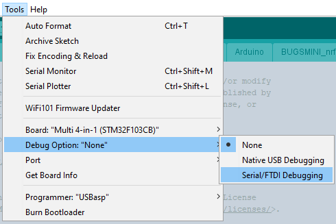
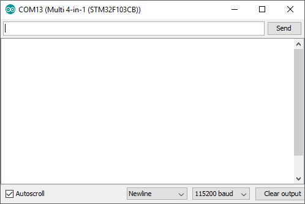

# Enable the STM32 module serial debug feature

To enable serial debug on your module you must know how to buid the firmware from the source code available on this GitHub. To do so follow this page: [Compiling and programming the STM32 module](Compiling_STM32.md).

Procedure:
1. Upload the debug firmware to the module:

iRangeX+, Banggood and old Jumper 4in1 modules|Recent Jumper 4in1 modules with built-in CP2102|FTDI
----------------------------------------------|-----------------------------------------------|----
Use the Debug Option: "Native USB Debugging"|Use the Debug Option: "Serial/FTDI Debugging"|Use the Debug Option: "Serial/FTDI Debugging"
Do not disconnect the USB cable. In case you have to do it, you have to connect the module, close and reopen the Serial Monitor to get the module working otherwise the status LED will do a [Fast double blink](Troubleshooting.md).|Do not disconnect the USB cable. In case you have to do it, you have to power the TX first, then connect the USB cable to the module and relaunch the Serial monitor.|No restrictions apart from relaunching the Serial monitor if you disconnect the FTDI from the PC.

2. Power on the TX
1. Open in the Arduino IDE the Serial Monitor: Tools->Serial Monitor or Ctrl+Shift+M  
1. Make sure the settings at the bottom of the Serial Monitor window are the same as the picture above especially the baud rate set to 115200 baud
1. The Serial Monitor window should show the module booting, selection of a different protocol and more depending on the protocol currently loaded  
1. At this stage you can test whatever is needed or have been instructed to do. You can easily select text in the window to copy and paste it on the forum or in a text file.
1. **Important: to use your module normally and before flying you must reupload the firmware as you usually do with the Debug Option set to "None"**
