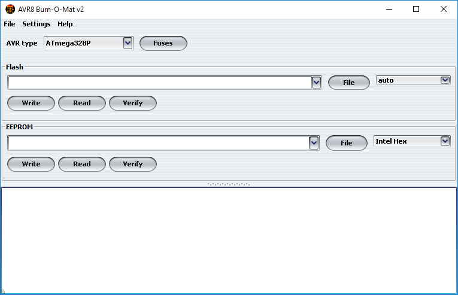
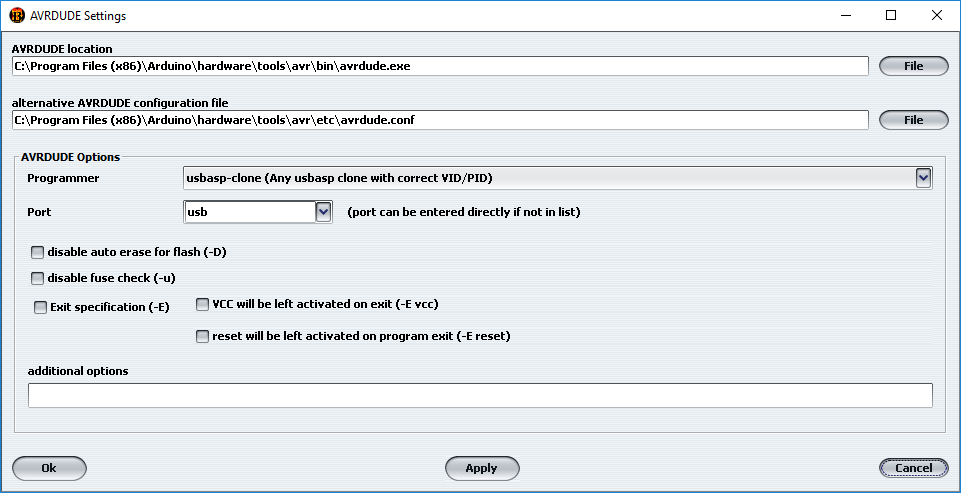
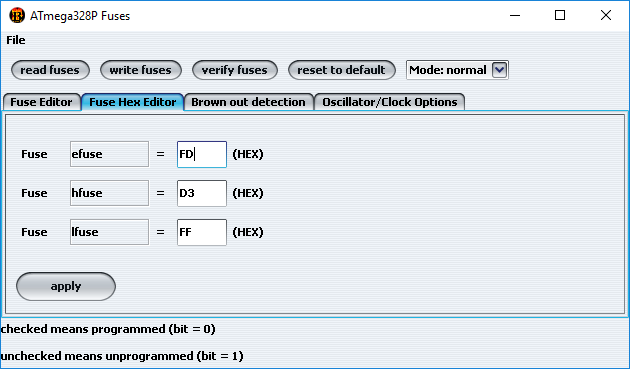

# Manually Uploading HEX files and setting Fuses on ATmega328

**The .hex files provided are only for tests purpose. The recommended method is to use [Compiling and Programming](Compiling.md).**

There are many different options to upload a .hex firmware file to the MULTI-Module and to set the correct fuses.  This document outlines an approach that uses a USBASP programmer and which is equally compatible with OSX, Windows and Linux operating systems.

1. Follow this section: [Material you need to upload the firmware](Compiling.md#material-you-need-to-upload-the-firmware)
1. Follow this section: [Install the Arduino IDE](Compiling.md#install-the-arduino-ide-and-the-multiprotocol-project-firmware)
1. Make sure to write down the location of your installation since you need to know where avrdude is installed to configure the AVR8 Burn-O-Mat. For example on a default windows installation, avrdude.exe is located in "C:\Program Files (x86)\Arduino\hardware\tools\avr\bin" where "C:\Program Files (x86)\Arduino" is the installation path.
1. Install [AVR8 Burn-O-Mat](http://avr8-burn-o-mat.brischalle.de/avr8_burn_o_mat_avrdude_gui_en.php) which is available for all platforms. Installation instructions are on the software page (Don't forget to install [Java](http://java.sun.com/javase/downloads) as explained).
1. Launch AVR8 Burn-O-Mat.
1. You should now have a window which looks like this:   
1. Click on **Settings->AVRDUDE** and fill in the details about avrdude location using the installation path written previously as well as selecting USBASP for the programmer:   
1. Once done click on OK.
1. You are now done with all the installations/configuration and ready to program your Multi-module.

## Fuse settings
The fuse settings have to be done only once for all.

Here are some fuse settings for common configurations:

Board|Extended Fuse (efuse)|High Fuse (hfuse)|Low Fuse (lfuse)
-----|--------|---------|-------------
Banggood 4-in-1 module |0xFD|0xD3|0xFF
Arduino Pro Mini |0xFD|0xD3|0xFF
DIY 2.3d PCB |0xFD|0xD3|0xFF
DIY 2.3d PCB with [custom mikeb bootloader](Advanced_ATmega_Serial_Uploader.md) |0xFD|0xD6|0xFF
Banggood 4-in-1 module with [custom mikeb bootloader](Advanced_ATmega_Serial_Uploader.md) |0xFD|0xD6|0xFF

If you don't know which one to take the 1st line is the one you want.

### Burn the fuses
1. Follow this section: [Connect the programmer](Compiling.md#connect-the-programmer)
1. Launch AVR8 Burn-O-Mat.
1. In the **AVR type** drop down select **ATmega328P** and click on **Fuses**
1. In the **ATmega328P Fuses** window which just open click on read fuses.
1. Ignore the error "warning : Can not Set sck period . usbasp please check for firmware update .".
1. If you get an error there is something wrong with your connections, your programmer, or your board. Verify everything and go back to the 1st bullet point.
1. Set the 3 Fuse values   
1. Click on **apply**
1. Click on **write fuses**
1. Ignore the error "warning : Can not Set sck period . usbasp please check for firmware update .".
1. If you get an error there is something wrong with your connections, your programmer, or your board. Verify everything and go back to the 1st bullet point.
1. You are done with setting the Fuses and can close the **ATmega328P Fuses** window

## Upload the firmware
1. Follow this section: [Connect the programmer](Compiling.md#connect-the-programmer)
1. Download the [latest release firmware](https://github.com/pascallanger/DIY-Multiprotocol-TX-Module/releases) you want to burn and store it in a knwon location
1. Launch AVR8 Burn-O-Mat.
1. In the **AVR type** drop down select **ATmega328P**
1. Under **Flash** select the file you've just downloaded
1. Under **Flash** click on **Write**
1. Ignore the error "warning : Can not Set sck period . usbasp please check for firmware update .".
1. If you get an error there is something wrong with your connections, your programmer, or your board. Verify everything and go back to the 1st bullet point.
1. You are done with uploading the firmware. Your module is ready to operate.
