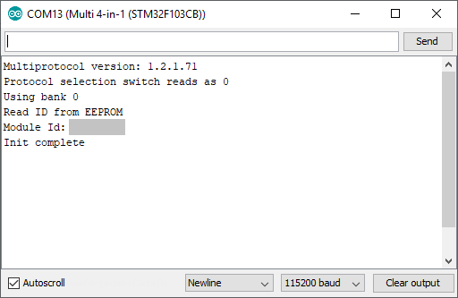

# XN297L dump feature

To get the XN297L dump feature working on your module you must know:
1. How to buid the firmware from the source code available on this GitHub. To do so follow this page: [Compiling and programming the STM32 module](Compiling_STM32.md).
1. How to enable serial debug [MULTI-Module Serial Debug](Advanced_Debug.md).

Procedure to use the XN297L dump feature:
1. Start the Multi module in serial debug mode with the Arduion IDE Serial Monitor open  
1. Select the protocol 63 or "Custom 63" to enable the XN297L Dump protocol
1. This protocol parameters are:
   * sub_protocol or type or the second number after "Custom 63" is used to set the transmission speed: 0=250Kbps, 1=1Mbps and 2=2Mbps. Any other value will default to 1Mbps.
   * RX_num or Receiver number sets the address length 3, 4 or 5 bytes. Any other value will default to an address length of 5 bytes.
   * option sets the RF channel number used to receive packets between 0..84 . A value of -1 will automatically scan all channels one by one. Any other value will default to the RF channel 0.

Examples:
TBC