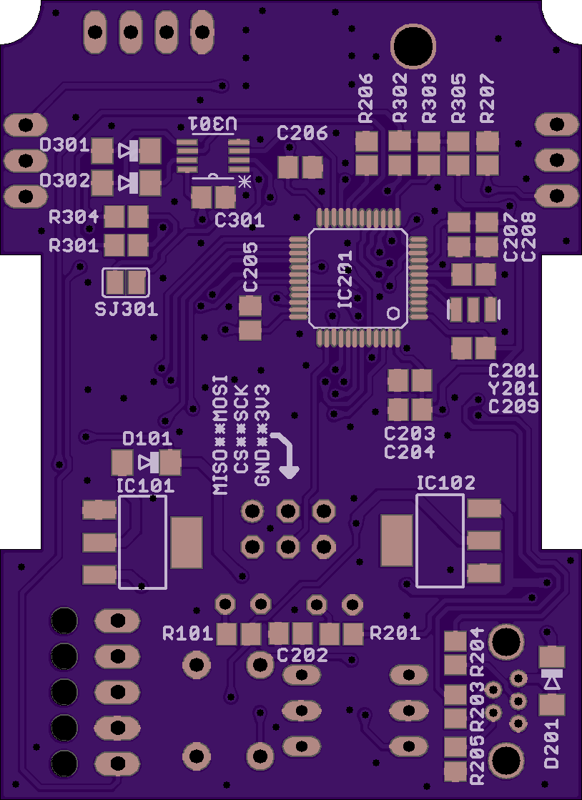
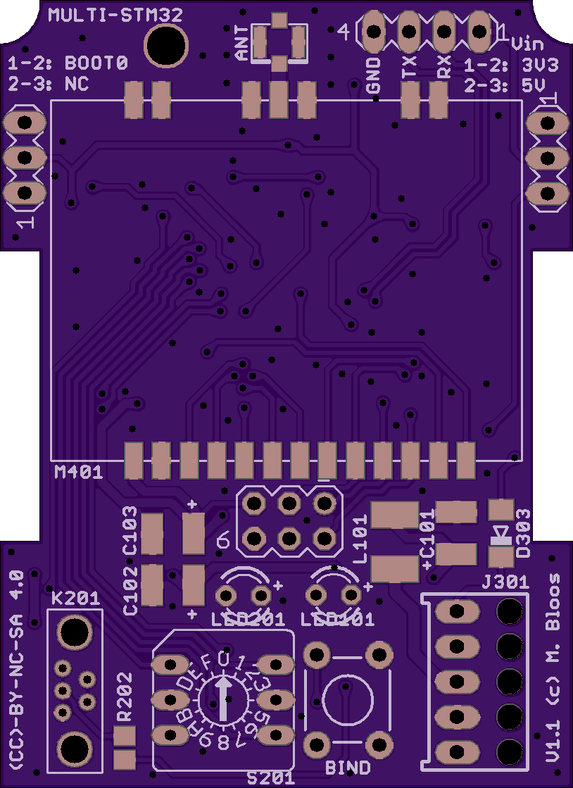
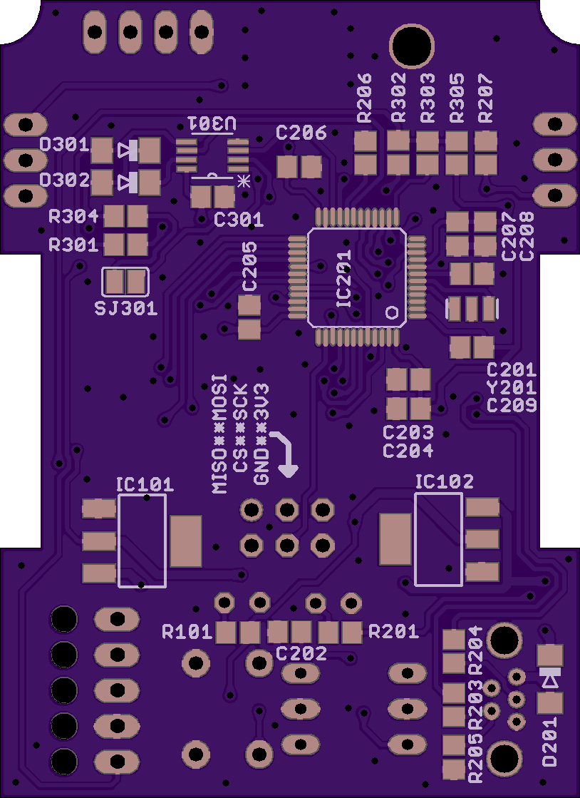
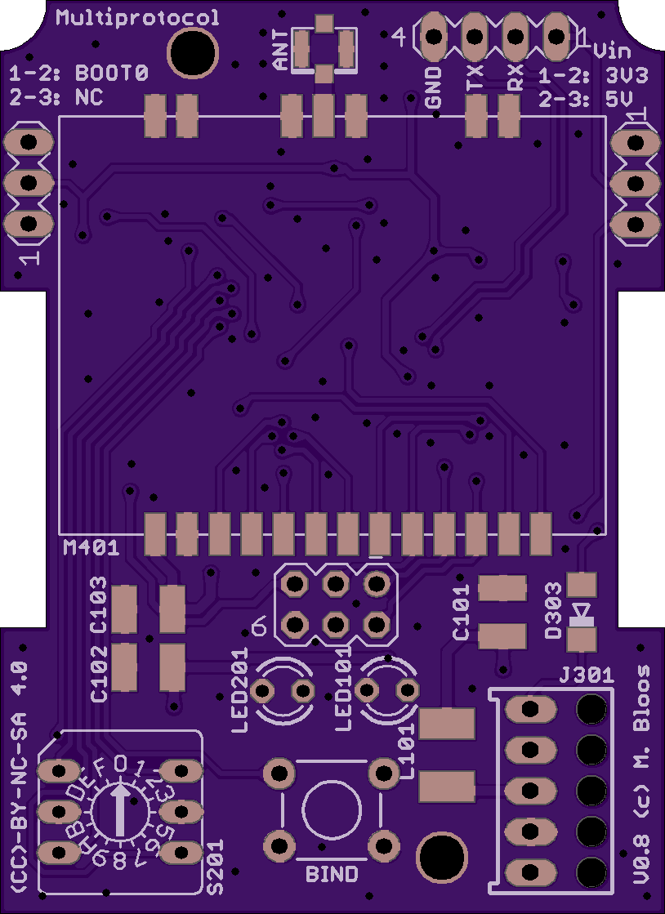

# Bill of Materials DIY STM32 Module 

Here is the bill of materials for the STM32 version of the DIY  MPTM. There are three versions. Carefully compare your board with the pictures below to determine which version you have. 

All diagrams and eagle files are available [here](https://github.com/pascallanger/DIY-Multiprotocol-TX-Module/tree/master/STM32%20PCB)

If you are looking for the BOM for the DIY ATmega328 3.2d version click [here](BOM_DIY_ATmega.md).

Digikey may not be your preferred supplier, but you should find enough information on their page to cross reference parts.
If digikey is your prefered supplier, their is a link to shared carts to make checkout easier at the begining of the BOM.

## IMPORTANT NOTE on Telemetry
In the case of the Turnigy 9X/9XR/9XR Pro you don't need to invert the telemetry signal therefore the instalation of the inverter chip SN74LVC2G86DCTR is  **OPTIONAL**. In this case and in order to have telemetry you need to solder **SJ1/SJ301** on the back of the board depending on which board version you have.

The inverted telemetry signal is required by TARANIS TX and other boards so for telemetry to work properly the inverter chip must be installed.

## BOM DIY STM32 PCB V1.1t -  USB version update
The board is available at OSHpark [here](https://oshpark.com/shared_projects/eWtNW6jo)

  

## BOM DIY STM32 PCB V1.0t & V1.1 - the USB version
This BOM is for the board with the USB port which allows firmware upload.

The board is available at OSHpark [here](https://oshpark.com/shared_projects/GX51nEoH)

  

Digikey BOM shared cart for building 1 module [here](http://www.digikey.com/short/3dn71h)

Digikey BOM shared cart for building 3 modules [here](http://www.digikey.com/short/3dnt2r)

Please Note - With the Digikey shared carts it is cheaper to order 10 piece stips with some parts like resistors and capacitors. These extra parts are not reflected or needed in the followong BOM list.

Qty|Part|Description|Value|Package|Digikey Part Number
---|----|-----------|-----|-------|-------------------
1|J301|Receptacle|5-pin||[WM3103-ND](http://www.digikey.com/product-search/en?keywords=WM3103-ND)
1|K201|USB Receptacle|USB||[732-2735-ND](https://www.digikey.com/product-search/en?keywords=651005136421)
1|SV201|Jumper|1x3||[S1011EC-40-ND](https://www.digikey.com/product-detail/en/sullins-connector-solutions/PRPC040SAAN-RC/S1011EC-40-ND/2775214)
1|SV202|Pin header|1x4||[S1011EC-40-ND](https://www.digikey.com/product-detail/en/sullins-connector-solutions/PRPC040SAAN-RC/S1011EC-40-ND/2775214)
1|SV203|Pin header for future use, **NOT ISP**|2x3||[S1011EC-40-ND](https://www.digikey.com/product-detail/en/sullins-connector-solutions/PRPC040SAAN-RC/S1011EC-40-ND/2775214)
1|SV204|Pin header|1x3||[S1011EC-40-ND](https://www.digikey.com/product-detail/en/sullins-connector-solutions/PRPC040SAAN-RC/S1011EC-40-ND/2775214)
3|C101, 102, 103|Cap Tantalum|22uF/16V (Band is +)|1206|[478-8254-1-ND](https://www.digikey.com/product-detail/en/avx-corporation/F931C226MAA/478-8254-1-ND/4005702)
7|C201, 202, 204, 205, 206, 209, 301|Cap Ceramic|0.1uF|0805|[311-1361-1-ND](https://www.digikey.com/product-detail/en/yageo/CC0805ZRY5V9BB104/311-1361-1-ND/2103145)
1|C203|Cap Ceramic|4u7|0805|[311-1371-1-ND](https://www.digikey.com/product-detail/en/yageo/CC0805ZRY5V6BB475/311-1371-1-ND/2103155)
1|C207|Cap Ceramic|1uF|0805|[311-1365-1-ND](https://www.digikey.com/product-detail/en/yageo/CC0805KKX7R7BB105/311-1365-1-ND/2103149)
1|C208|Cap Ceramic|10nF|0805|[311-1136-1-ND](http://www.digikey.com/products/en?keywords=311-1136-1-ND)
5|D101*,201,301,302,303|Diode Shottky|BAT48|SOD123|[497-5712-1-ND](http://www.digikey.com/products/en?keywords=497-5712-1-ND)
1|IC101|Voltage reg 5V|AMS1117-50|SOT223|[LM1117MP-5.0/NOPBCT-ND](https://www.digikey.com/product-detail/en/texas-instruments/LM1117MP-5.0-NOPB/LM1117MP-5.0-NOPBCT-ND/363589)
1|IC102|Voltage reg 3.3V|AMS1117-33|SOT223|[LM1117MPX-3.3/NOPBCT-ND](https://www.digikey.com/product-detail/en/texas-instruments/LM1117MPX-3.3-NOPB/LM1117MPX-3.3-NOPBCT-ND/1010516)
1|L101|High Freq Inductor|10uH|1812|[CM453232-100KLCT-ND](https://www.digikey.com/product-detail/en/bourns-inc/CM453232-100KL/CM453232-100KLCT-ND/3437938)
1|LED101|Green Led|LED3mm||[516-3191-1-ND](http://www.digikey.com/products/en?keywords=516-3191-1-ND)
1|LED201|Red Led|LED3mm||[516-1750-1-ND](http://www.digikey.com/products/en?keywords=516-1750-1-ND)
2|R101, 201|SMD Resistor|1K|0805|[311-1.0KARCT-ND](https://www.digikey.com/product-detail/en/yageo/RC0805JR-071KL/311-1.0KARCT-ND/731165)
1|R202|SMD Resistor|1.5K|0805|[311-1.5KARCT-ND](https://www.digikey.com/product-search/en?keywords=311-1.5KARCT-ND)
2|R203, 204|SMD Resistor|22|0805|[311-22ARCT-ND](https://www.digikey.com/product-search/en?keywords=311-22ARCT-ND)
1|R205|SMD Resistor|100K|0805|[311-100KARCT-ND](https://www.digikey.com/product-search/en?keywords=311-100KARCT-ND)
2|R206, R207|SMD Resistor|10K|0805|[RMCF0805JT10K0CT-ND](https://www.digikey.com/product-detail/en/stackpole-electronics-inc/RMCF0805JT10K0/RMCF0805JT10K0CT-ND/1942577)
2|R301, R305|SMD Resistor|4.7K|0805|[311-4.70KCRCT-ND](https://www.digikey.com/product-detail/en/yageo/RC0805FR-074K7L/311-4.70KCRCT-ND/730876)
2|R302, R303|SMD Resistor|2.2K|0805|[RMCF0805JT2K20CT-ND ](https://www.digikey.com/product-detail/en/stackpole-electronics-inc/RMCF0805JT2K20/RMCF0805JT2K20CT-ND/1942563)
1|R304|SMD Resistor|470|0805|[RMCF0805JT470RCT-ND](https://www.digikey.com/product-detail/en/stackpole-electronics-inc/RMCF0805JT470R/RMCF0805JT470RCT-ND/1942551)
1|S201|Hex Switch||DIP|[563-1065-ND](https://www.digikey.com/product-detail/en/copal-electronics-inc/SD-1110/563-1065-ND/948376)
1|S202|Momentary Switch||6mm|[450-1643-ND](https://www.digikey.com/product-detail/en/te-connectivity-alcoswitch-switches/2-1825910-7/450-1642-ND/1632528)
1|IC201|STM32F103CBT6||LQFP48|[STM32F103CBT6](https://www.digikey.com/product-detail/en/stmicroelectronics/STM32F103CBT6/497-6288-ND/1754420)
1|M401|4-in-1 RF Module|||[Banggood 4-in-1 Module](http://www.banggood.com/DIY-2_4G-CC2500-NRF24L01-A7105-CYRF6936-Multi-RF-4-IN-1-Wireless-Module-p-1046308.html)
1|Y201|8mHz Resonator|8mHz||[490-1195-1-ND](https://www.digikey.com/product-detail/en/murata-electronics-north-america/CSTCE8M00G55-R0/490-1195-1-ND/584632)
1|U301|Dual INPUT-XOR|SN74LVC2G86DCTR|SSM8|[296-13274-1-ND](http://www.digikey.com/product-detail/en/texas-instruments/SN74LVC2G86DCTR/296-13274-1-ND/484501)
1|CON401|ANT.conn SMD|||[WM5587CT-ND](https://www.digikey.com/product-detail/en/molex-llc/0734120110/WM5587CT-ND/1894612)

* Diode D101 is only required for the V1.1 board

PCB STM32 V1.0t Schematic
 

## BOM DIY STM32 PCB - the V0.8
 This BOM is for the board that looks like the image below (avialble from OSHpark [here](https://oshpark.com/shared_projects/3IU1JXoN)) - check carefully:
 
 

Qty|Part|Description|Value|Package|Digikey Part Number
---|----|-----------|-----|-------|-------------------
1|J301|Receptacle|5-pin||[WM3103-ND](http://www.digikey.com/product-search/en?keywords=WM3103-ND)
1|SV201|Jumper|1x3||[S1011EC-40-ND](https://www.digikey.com/product-detail/en/sullins-connector-solutions/PRPC040SAAN-RC/S1011EC-40-ND/2775214)
1|SV202|Pin header|1x4||[S1011EC-40-ND](https://www.digikey.com/product-detail/en/sullins-connector-solutions/PRPC040SAAN-RC/S1011EC-40-ND/2775214)
1|SV203|Pin header|1x3||[S1011EC-40-ND](https://www.digikey.com/product-detail/en/sullins-connector-solutions/PRPC040SAAN-RC/S1011EC-40-ND/2775214)
1|SV204|Pin header|1x3||[S1011EC-40-ND](https://www.digikey.com/product-detail/en/sullins-connector-solutions/PRPC040SAAN-RC/S1011EC-40-ND/2775214)
3|C101, 102, 103|Cap Tantalum|22uF/16V (Band is +)|1206|[478-8254-1-ND](https://www.digikey.com/product-detail/en/avx-corporation/F931C226MAA/478-8254-1-ND/4005702)
7|C201, 202, 204, 205, 206, 209, 301|Cap Ceramic|0.1uF|0805|[311-1361-1-ND](https://www.digikey.com/product-detail/en/yageo/CC0805ZRY5V9BB104/311-1361-1-ND/2103145)
1|C203|Cap Ceramic|4u7|0805|[311-1371-1-ND](https://www.digikey.com/product-detail/en/yageo/CC0805ZRY5V6BB475/311-1371-1-ND/2103155)
1|C207|Cap Ceramic|1uF|0805|[311-1365-1-ND](https://www.digikey.com/product-detail/en/yageo/CC0805KKX7R7BB105/311-1365-1-ND/2103149)
1|C208|Cap Ceramic|10nF|0805|[311-1085-1-ND](http://www.digikey.com/product-detail/en/yageo/CC0603KRX7R9BB103/311-1085-1-ND/302995)
3|D301, D302, D303|Diode Shottky|BAT48|SOD123|[497-5712-1-ND](http://www.digikey.com/products/en?keywords=497-5712-1-ND)
1|IC101|Voltage reg 5V|AMS1117-50|SOT223|[LM1117MP-5.0/NOPBCT-ND](https://www.digikey.com/product-detail/en/texas-instruments/LM1117MP-5.0-NOPB/LM1117MP-5.0-NOPBCT-ND/363589)
1|IC102|Voltage reg 3.3V|AMS1117-33|SOT223|[LM1117MPX-3.3/NOPBCT-ND](https://www.digikey.com/product-detail/en/texas-instruments/LM1117MPX-3.3-NOPB/LM1117MPX-3.3-NOPBCT-ND/1010516)
1|L101|High Freq Inductor|10uH|1812|[CM453232-100KLCT-ND](https://www.digikey.com/product-detail/en/bourns-inc/CM453232-100KL/CM453232-100KLCT-ND/3437938)
1|LED101|Green Led|LED3mm||[516-3191-1-ND](http://www.digikey.com/products/en?keywords=516-3191-1-ND)
1|LED201|Red Led|LED3mm||[516-1750-1-ND](http://www.digikey.com/products/en?keywords=516-1750-1-ND)
2|R302, R303|SMD Resistor|2.2K|0805|[RMCF0805JT2K20CT-ND ](https://www.digikey.com/product-detail/en/stackpole-electronics-inc/RMCF0805JT2K20/RMCF0805JT2K20CT-ND/1942563)
3|R202, R203|SMD Resistor|10K|0805|[RMCF0805JT10K0CT-ND](https://www.digikey.com/product-detail/en/stackpole-electronics-inc/RMCF0805JT10K0/RMCF0805JT10K0CT-ND/1942577)
1|R301, R305|SMD Resistor|4.7K|0805|[311-4.70KCRCT-ND](https://www.digikey.com/product-detail/en/yageo/RC0805FR-074K7L/311-4.70KCRCT-ND/730876)
1|R101, 201|SMD Resistor|1K|0805|[311-1.0KARCT-ND](https://www.digikey.com/product-detail/en/yageo/RC0805JR-071KL/311-1.0KARCT-ND/731165)
1|R304|SMD Resistor|470|0805|[RMCF0805JT470RCT-ND](https://www.digikey.com/product-detail/en/stackpole-electronics-inc/RMCF0805JT470R/RMCF0805JT470RCT-ND/1942551)
1|S201|Hex Switch||DIP|[563-1065-ND](https://www.digikey.com/product-detail/en/copal-electronics-inc/SD-1110/563-1065-ND/948376)
1|S202|Momentary Switch||6mm|[	450-1643-ND](https://www.digikey.com/product-detail/en/te-connectivity-alcoswitch-switches/2-1825910-7/450-1642-ND/1632528)
1|IC201|STM32F103CBT6||LQFP48|[STM32F103CBT6](https://www.digikey.com/product-detail/en/stmicroelectronics/STM32F103CBT6/497-6288-ND/1754420)
1|M401|4-in-1 RF Module|||[Banggood 4-in-1 Module](http://www.banggood.com/DIY-2_4G-CC2500-NRF24L01-A7105-CYRF6936-Multi-RF-4-IN-1-Wireless-Module-p-1046308.html)
1|Y201|8mHz Resonator|8mHz||[490-1195-1-ND](https://www.digikey.com/product-detail/en/murata-electronics-north-america/CSTCE8M00G55-R0/490-1195-1-ND/584632)
1|U301|Dual INPUT-XOR|SN74LVC2G86DCTR|SSM8|[296-13274-1-ND](http://www.digikey.com/product-detail/en/texas-instruments/SN74LVC2G86DCTR/296-13274-1-ND/484501)
1|CON401|SMD ant. conn.|||[WM5587CT-ND](https://www.digikey.com/product-detail/en/molex-llc/0734120110/WM5587CT-ND/1894612)

## BOM DIY STM32 PCB - the first Version
 This BOM is for the board that looks like this - check carefully:
 
  

Qty|Part|Description|Value|Package|Digikey Part Number
---|----|-----------|-----|-------|-------------------
1|3.3VJumper|Jumper|1x2||[3M9467-ND](https://www.digikey.com/product-detail/en/3m/961102-5604-AR/3M9467-ND/2071508)
2|C1,C2|Cap Ceramic|0.1uF|0805|[311-1361-1-ND](https://www.digikey.com/product-detail/en/yageo/CC0805ZRY5V9BB104/311-1361-1-ND/2103145)
3|C3,8,9|Cap Tantalum|22uF/16V (Band is +)|1206|[478-8254-1-ND](https://www.digikey.com/product-detail/en/avx-corporation/F931C226MAA/478-8254-1-ND/4005702)
1|D1|Diode Shottky|1N5819||[1N5819HW-FDICT-ND](https://www.digikey.com/product-detail/en/diodes-incorporated/1N5819HW-7-F/1N5819HW-FDICT-ND/815283)
1|IC1|Voltage reg 3.3V|AMS1117-33|SOT223|[LM1117MPX-3.3/NOPBCT-ND](https://www.digikey.com/product-detail/en/texas-instruments/LM1117MPX-3.3-NOPB/LM1117MPX-3.3-NOPBCT-ND/1010516)
1|IC2|Voltage reg 5V|AMS1117-50|SOT223|[LM1117MP-5.0/NOPBCT-ND](https://www.digikey.com/product-detail/en/texas-instruments/LM1117MP-5.0-NOPB/LM1117MP-5.0-NOPBCT-ND/363589)
1|J301|Receptacle|5-pin||[WM3103-ND](http://www.digikey.com/product-search/en?keywords=WM3103-ND)
1|JP1|Pin header|1x3||[S1011EC-40-ND](https://www.digikey.com/product-detail/en/sullins-connector-solutions/PRPC040SAAN-RC/S1011EC-40-ND/2775214)
1|JP2|Pin header|1x4||[S1011EC-40-ND](https://www.digikey.com/product-detail/en/sullins-connector-solutions/PRPC040SAAN-RC/S1011EC-40-ND/2775214)
1|L1|High Freq Inductor|10uH|1812|[CM453232-100KLCT-ND](https://www.digikey.com/product-detail/en/bourns-inc/CM453232-100KL/CM453232-100KLCT-ND/3437938)
1|LED|Red Led|LED3mm||[516-1750-1-ND](http://www.digikey.com/products/en?keywords=516-1750-1-ND)
2|R1,R8|SMD Resistor|2.2K|0805|[RMCF0805JT2K20CT-ND ](https://www.digikey.com/product-detail/en/stackpole-electronics-inc/RMCF0805JT2K20/RMCF0805JT2K20CT-ND/1942563)
3|R2,R5,R10|SMD Resistor|10K|0805|[RMCF0805JT10K0CT-ND](https://www.digikey.com/product-detail/en/stackpole-electronics-inc/RMCF0805JT10K0/RMCF0805JT10K0CT-ND/1942577)
1|R3|SMD Resistor|4.7K|0805|[311-4.70KCRCT-ND](https://www.digikey.com/product-detail/en/yageo/RC0805FR-074K7L/311-4.70KCRCT-ND/730876)
1|R5|SMD Resistor|1K|0805|[311-1.0KARCT-ND](https://www.digikey.com/product-detail/en/yageo/RC0805JR-071KL/311-1.0KARCT-ND/731165)
1|R7|SMD Resistor|470|0805|[RMCF0805JT470RCT-ND](https://www.digikey.com/product-detail/en/stackpole-electronics-inc/RMCF0805JT470R/RMCF0805JT470RCT-ND/1942551)
1|Switch|Hex Switch||DIP|[563-1065-ND](https://www.digikey.com/product-detail/en/copal-electronics-inc/SD-1110/563-1065-ND/948376)
1|Switch|Momentary Switch||6mm|[	450-1643-ND](https://www.digikey.com/product-detail/en/te-connectivity-alcoswitch-switches/2-1825910-7/450-1642-ND/1632528)
1|MCU|STM32F103CBT6||LQFP48|[STM32F103CBT6](https://www.digikey.com/product-detail/en/stmicroelectronics/STM32F103CBT6/497-6288-ND/1754420)
1|U$1|4-in-1 RF Module|||[Banggood 4-in-1 Module](http://www.banggood.com/DIY-2_4G-CC2500-NRF24L01-A7105-CYRF6936-Multi-RF-4-IN-1-Wireless-Module-p-1046308.html)
1|Y2|8mHz Resonator|8mHz||[490-1195-1-ND](https://www.digikey.com/product-detail/en/murata-electronics-north-america/CSTCE8M00G55-R0/490-1195-1-ND/584632)
1|U301|Dual INPUT-XOR|SN74LVC2G86DCTR|SSM8|[296-13274-1-ND](http://www.digikey.com/product-detail/en/texas-instruments/SN74LVC2G86DCTR/296-13274-1-ND/484501)
1|U.FL|SMD ant. conn.|||[WM5587CT-ND](https://www.digikey.com/product-detail/en/molex-llc/0734120110/WM5587CT-ND/1894612)

PCB STM32 V0.1 Schematic
 
