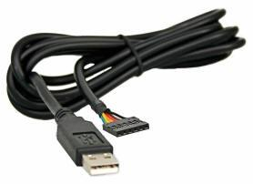
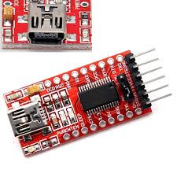

# Compiling and Programming (ATmega 328P)

**If you are Compling for the STM32 version of the Multiprotocol Module please go to the dedicated [Compiling and Programming STM32](Compiling_STM32.md) page.** 

**This page describes the basic Compiling and Programming process.  There are some other more advanced processes that have some superior features described under the [Advanced Topics](Advanced_Topics.md) page.** Some options are: 
 - Using an FTDI cable to upload firmware over the module - Tx pins


Multiprotocol source can be compiled using the Arduino IDE.  

##Install the Arduino IDE and the Multiprotocol project
1. Download the Arduino IDE. The currently supported Arduino version is 1.6.10. available for [Windows]( https://www.arduino.cc/download_handler.php?f=/arduino-1.6.10-windows.exe) and [Mac OSX](http://arduino.cc/download_handler.php?f=/arduino-1.6.10-macosx.zip)
1. Download the zip file with the Multiprotocol module source code from [here](https://github.com/pascallanger/DIY-Multiprotocol-TX-Module/archive/master.zip)
1. Unzip and copy the source code folder **Multiprotocol** to a folder of your choosing
1. Click on the **Multiprotocol.ino** file in the **Multiprotocol** folder and the Arduino environment should appear and the Multiprotocol project will be loaded.

##Prepare the Arduino IDE:
The Arduino IDE must be customized to optimally compile the firmware. The following additions to the environment will remove the Arduino bootloader to free up additional memory for protocols.
###Mac OSX:
1. Using finder navigate to ```Applications``` folder
1. Ctl-Click on the Arduino application and select **Show Package Contents**.
1. Browse to ```Contents/Java/hardware/arduino`` and double click on boards.txt
1. Copy and paste the following text into the end of the file and save it:

```
##############################################################
## Multi 4-in-1 (3.3V, 16 MHz) w/ ATmega328
## --------------------------------------------------
multi.name=Multi 4-in-1

multi.upload.tool=avrdude
multi.upload.protocol=arduino

multi.bootloader.tool=avrdude
multi.bootloader.unlock_bits=0x3F
multi.bootloader.lock_bits=0x0F

multi.build.board=AVR_PRO
multi.build.core=arduino
multi.build.variant=eightanaloginputs

multi.menu.cpu.16MHzatmega328=ATmega328 (3.3V, 16 MHz)

multi.menu.cpu.16MHzatmega328.upload.maximum_size=32768
multi.menu.cpu.16MHzatmega328.upload.maximum_data_size=2048
multi.menu.cpu.16MHzatmega328.upload.speed=57600

multi.menu.cpu.16MHzatmega328.bootloader.low_fuses=0xFF
multi.menu.cpu.16MHzatmega328.bootloader.high_fuses=0xD3
multi.menu.cpu.16MHzatmega328.bootloader.extended_fuses=0xFD

multi.menu.cpu.16MHzatmega328.build.mcu=atmega328p
multi.menu.cpu.16MHzatmega328.build.f_cpu=16000000L
##############################################################
```
1. Open the file *platform.txt* in the same folder and change the line that reads

```compiler.c.elf.extra_flags= ```

to

```compiler.c.elf.extra_flags=-Wl,--relax ```

paste the following text into the end of the file and save it. 

Close and reopen the Arduino IDE and load the Multiprotocol project.

### Windows:
Using File Explorer navigate to 

```C:\Program Files(x86)\Arduino\hardware\arduino\avr ```

Open ```boards.txt``` in your favourite text editor (Notepad)

Copy and paste the "Multi 4-in-1" text listed above into the end of the file and save it.

Open the file *platform.txt* in the same folder and change the line that reads

```compiler.c.elf.extra_flags= ```

to

```compiler.c.elf.extra_flags=-Wl,--relax ```

Close and reopen the Arduino IDE and load the Multiprotocol project.

## Common process for OSX and Windows
If you have module with an Arduino Pro-Mini then scroll down to [Programming Arduino Pro-Mini Boards](#Programming_Arduino_Pro_Mini)

If you are using one of the DIY Mulitprotocol modules with the ATmega soldered directly to a PCB (like the 3.2d board or the Banggood readymade 4-in-1 module) then follow these instructions.  
###Preparing for ATMega328P microcontroller
1. Under the Tools -> Board select the Multi 4-in-1 board
1. Under Tools -> Programmer select your programmer (probably USBASP)

<a name="CustomizeFirmareToYourNeeds"></a>
###Customize the firmware to your hardware and your needs
On all modules with ATMega microprocessors, the memory required for all the protocols exceeds the available 32k of flash memory.  You will need to select which protocols you wish to use that will fit into the available memory.

Before customizing your firmware it would be good to review the protocol on the [Protocol Details](../Protocol_Details.md) page and to identify the protocols you would like to support on your module.  

At the same time make a note of RF modules required by your protocols.  For example, if you do not wish to use the FlySky or the Husan protocols then you do not need to compile support the the A7105 RF Module into your firmware.  Similarly, if you have no need to bind with ASSAN RC receivers then you do not need to compile the ASSAN protocol into your firmware. 

If you plan to use the PPM communication interface with your transmitter, then you need to perform protocol selection with the 16 position switch on your module.  This will limit the available protocols you can usefully include on your firmware to 15.  You should make a list of your 15 chosen protocols, sub protocols and options like this:

Switch Position|Protocol|Sub-Protocol|Option|Notes
---------------|--------|------------|------|-----
1.|DSM|DSM2|2|6 channels @ 22ms
2.|DSM|DSMX|6|6 channels @ 11ms
....|...|...|...|...
....|...|...|...|...
15.|FRSKYX|CH_16| |FrSky X receiver 16 chan


With the above information (required RF modules, selected protocols and 16 pos switch mapping) you are ready to customize your firmware.  

All customization is done by editing the ```_Config.h  ``` file in the Multiprotocol Arduino project.  

In the Arduino IDE and click on the down arrow on the far right of the tab bar to show a list of project files (see the red circle on the screenshot below).  Scroll down and select the _Config.h file.


Comment out any of the RF modules that you do not need by typing ```// ``` at the begining of the line that reads : 
```#define <RF Module name>_INSTALLED ``` .  The following line shows the CC2500 module removed 

> ```#define A7105_INSTALLED ```

> ```#define CYRF6936_INSTALLED ```

> **```//#define CC2500_INSTALLED ```**

> ```#define NFR24L01_INSTALLED ```

Scroll down to the available protocols and comment out all the protocols you will not require.  The following example shows the DEVO protocol commented out.

> ```#ifdef	CYRF6936_INSTALLED ```

> **``` //	#define	DEVO_CYRF6936_INO ```**

> ``` 	#define	DSM_CYRF6936_INO ```

> ```	#define J6PRO_CYRF6936_INO ```

> ``` #endif ```

If you have a Taranis Tx and you plan on using Serial mode with telemetry find and uncomment the  INVERT_TELEMETRY line below:
> ```//Uncomment to invert the polarity of the telemetry serial signal.``` 

> ```//For ER9X and ERSKY9X it must be commented. For OpenTX it must be uncommented.``` 

> ```#define INVERT_TELEMETRY	1``` 

 Scroll down to the bottom of the file and list your switch mapping to your desired **protocol/sub-protocol/options**.  You typically only need to change the three relevant columns.  On models that require a rebind on every start-up (like Syma quads) you can change the **```NO_AUTOBIND ```** to **```AUTOBIND ```**.

You can now compile the firmware by clicking on the check mark (Tooltip: Verify) on the menu bar.  If everything goes according to plan you should see something like the following line in the lower pane of the window:

> Sketch uses 32,464 bytes (99%) of program storage space. Maximum is 32,768 bytes.
> Global variables use 1,219 bytes (59%) of dynamic memory, leaving 829 bytes for local variables. Maximum is 2,048 bytes.

if you see something like the following, your firmware is still too big and you need to deselect additional protocols:
> Sketch uses 34,096 bytes (104%) of program storage space. Maximum is 32,768 bytes.
> Global variables use 1,236 bytes (60%) of dynamic memory, leaving 812 bytes for local variables. Maximum is 2,048 bytes.
> Sketch too big; see http://www.arduino.cc/en/Guide/Troubleshooting#size for tips on reducing it.

If there is another error carefully read the error to see the approximate line number where you made a typing error. 


###Connecting the programmer
To complete this step you need an USBASP programmer like the one shown below and a 10-pin to 6-pin programming cable.


1. Before you connect the programmer make sure that you have selected the 3.3V mode and not the 5V mode.  The RF Modules are not 5V tolerant and you will harm with 5V.  On most programmers this is done by moving a jumper on the programmer.
1. Please re-read item 1. above before going on.
1. Turn the rotary switch on the DIY Multiprotocol module to the 0 position. If you do not have a switch (if you are using only Serial mode) then it the same as being in the 0 position. The upload will not work if the switch is in any other position.
1. Connect the 6-pin programming connector to the 6-pin ASP IVR connector on the DIY Multiprotocol board. Be sure to match the ground pin of the programmer connector to the ground pin on the board (see the images below for the pin layout and the location of the ground pin on the board) {insert pictures AVR ISP Pinout.png and images of boards with ground pin marked}
1. You are now ready to plug in the USB programmer to the computer
1. You are now ready to flash the firmware.  In the Arduino IDE click **Sketch -> Upload Using Programmer**.
2. If you get an error that indicates a valid microprocessor was not found there is something wrong with:
 - your connections, 
 - your programmer, or
 - your board
 - Google around with the specific error message to get suggestions of how to fix it.  The most common cause is problems with the connection setup and in some cases problems with the cheap programmers from Chinese sources.
1. The final step is to flash the fuses of the microprocessor.  These correct fuses will do a few things:
 -  Prevent the EEPROM from being erased each time the firmware is flashed.  This will preserve your Tx ID and save you from having to rebind all your models after an update of the firmware
 - Configure the clock source of the board - this is very important if you built the board from components.  The ATMega328P microprocessor is configured at the factory to use an internal 8Mhz clock.  The DIY Multiprotocol boards have a much more accurate 16MHz external crystal and the fuses will tell the MCU to use this clock source.  (If you were able to flash the board but after setting the fuses the board no longer responds, it is very likely that you have a problem with your external clock.)
 - Set the program counter to point at the right place when the module is powered up.  The fuses configure the MCU to use a bootloader or not.  If you compiled the firmware without a bootloader then the fuses must be set accordingly. 
1. In the Arduino IDE ensure that the **4-in-1 Multi** is selected under **Tools -> Board:** click on **Tools -> Burn Bootloader**.  Do not worry if it returns the error that no bootloader was found (in the case of the 4-in-1 board), it has burned the fuses.  If you IDE was set to provide verbose compilation and uploading output, you should be able to see the final value of the fuses in the Arduino IDE.

If the output indicates that the fuses have been successfully written give yourself a pat on the back.  Well done, you have successfully programmed your DIY Multiprotocol module and you are ready to go on to the final step [Setting up your Transmitter](TransmitterSetup.md) before you can begin to fly!!!!

<a name="Programming_Arduino_Pro_Mini"></a>
##Programming Arduino Pro-Mini Boards <a name="Programming_Arduino_Pro_Mini"></a>
Use this method only for Arduino Pro Mini boards with bootloader.  

1. Use an external FTDI adapter like one of these options:  
   
1. The programmer should be set to 3.3V or nothing to not supply any over voltage to the multimodule and avoid any damages.   
1. Under the **Tools -> Board:** select the **Arduino Pro-Mini**  
1. Under **Tools -> Processor** select the **Atmega328p (5V, 16Mhz)**  
1. Under **Tools -> Port** select your the serial port your programmer is connected to (it should appear on the the list)  
1. Scroll back to the section [Customize the firmware to your hardware and your needs](#CustomizeFirmareToYourNeeds) above and follow the instructions remembering that you can simply use the Upload button in the Arduino IDE to upload firmware using the Arduino bootloader:  
 - From the Arduino environment, you can use Upload button which will compile and upload to the module: Sketch->Upload (Ctrl+U)

To change the fuses you will need to use an external programmer (like USBasp mentioned above) and a flash tool that fits over the MCU and connects to the required pins, like this one:     
[](http://www.hobbyking.com/hobbyking/store/__27195__Atmel_Atmega_Socket_Firmware_Flashing_Tool.html)  
It connects to the USBASP programmer and connects directly to the pins on the microcontroller and it will allow you to set fuses and to program the Pro-Mini like the 4-in-1 boards above, without using the bootloader.

Follow the instructions in [Advanced Topics - Manually Setting Fuses](Advanced_Manually_Setting_ATmega328_Fuses.md) to set the fuses.  

If building the board from scratch was your chosen strategy we suspect that you would already know how to do this.  If not, Google is your friend, try something like “how to flash fuses on Arduino pro-mini”.  

