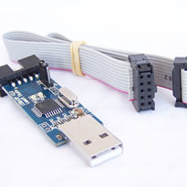
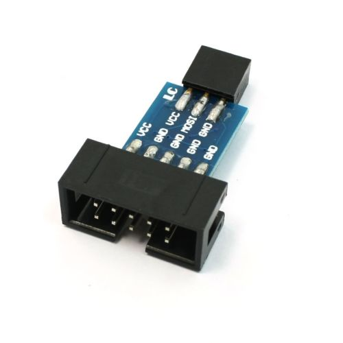
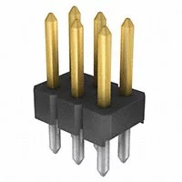
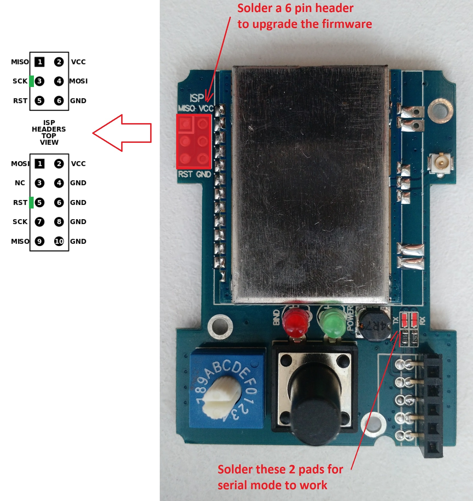
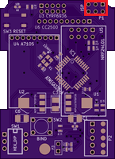
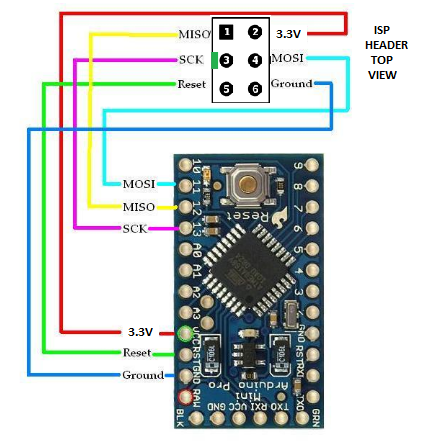
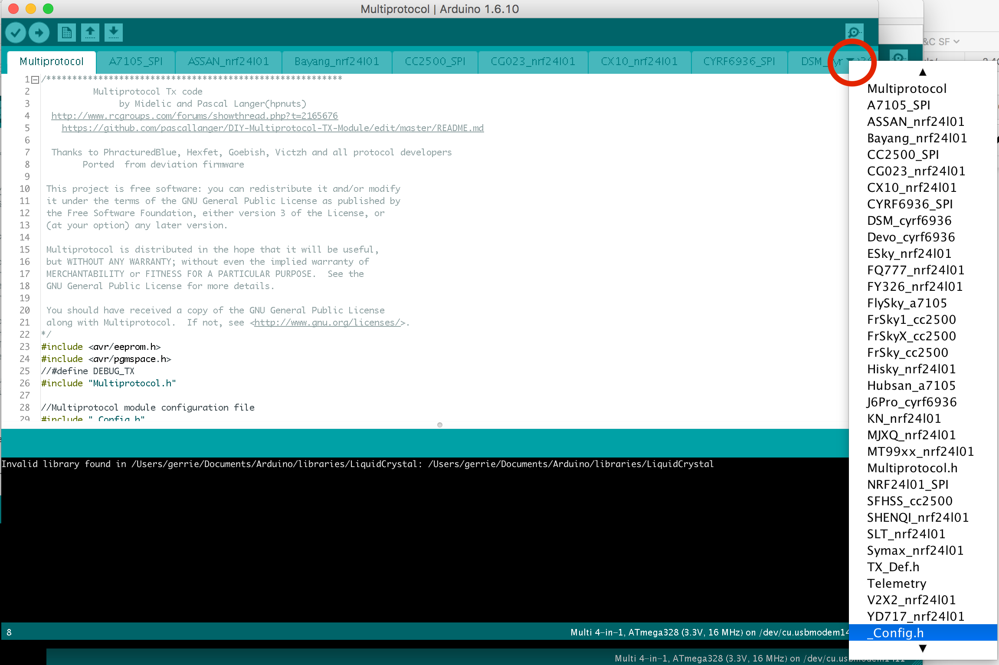
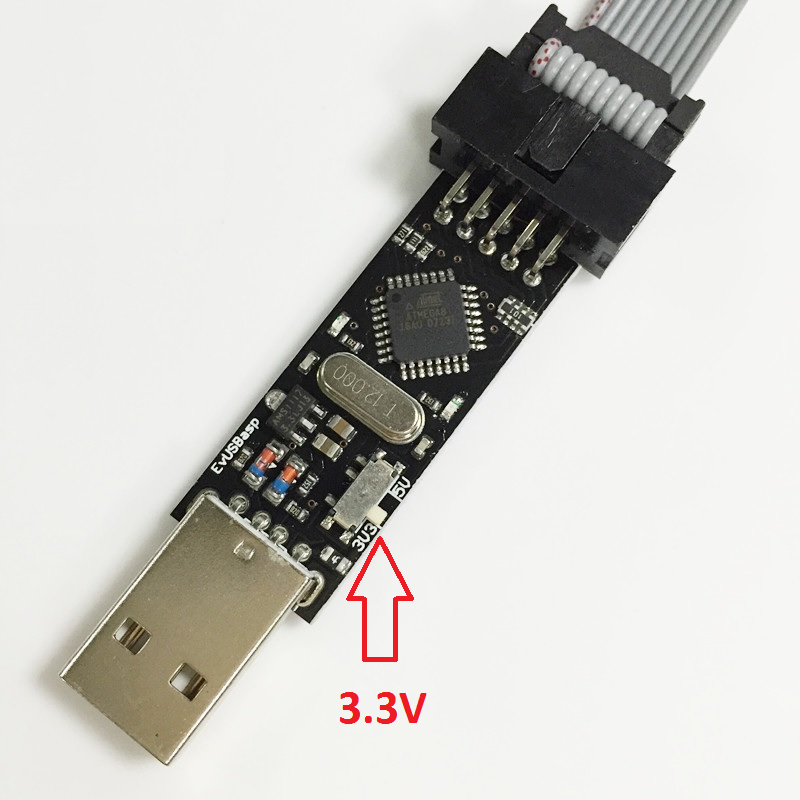

# Compiling and Programming (ATmega328p)

Multiprotocol firmware is compiled using the Arduino IDE.  The guide below will walk you through all the steps to compile and upload your customized firmware.

**These instructions are for the Atmega328p version of the Multiprotocol module.**  If you are compling for the STM32 version please go to the dedicated [STM32](Compiling_STM32.md) page.

## Index
1. [Tools Required](#tools-required)
1. [Preparation](#preparation)
   1. [Install the Arduino IDE](#install-the-arduino-ide)
   1. [Download the Multiprotocol source and open the project](#download-the-multiprotocol-source-and-open-the-project)
   1. [Install the Multi 4-in-1 board](#install-the-multi-4-in-1-board)
   1. [Configure the Arduino IDE](#configure-the-arduino-ide)
1. [Configure the firmware](#configure-the-firmware)
   1. [Customize the firmware to match your hardware and your needs](#customize-the-firmware-to-match-your-hardware-and-your-needs)
   1. [Verify the firmware](#verify-the-firmware)
1. [Compiling and uploading the firmware](#compiling-and-uploading-the-firmware)
   1. [Connect the programmer](#connect-the-programmer)
   1. [Burn bootloader and set fuses](#burn-bootloader-and-set-fuses)
   1. [Upload the firmware](#upload-the-firmware)
      1. [Flash from TX](#flash-from-tx)
      1. [Upload using Arduino IDE](#upload-using-arduino-ide)
1. [Troubleshooting](#troubleshooting)

## Tools required

| **3.3V USBasp Programmer** | **10-pin to 6-pin Adapter** | **6-pin header** |
|:---:|:---:|:---:|
|  |  |  |
| [(example aliexpress link)](https://www.aliexpress.com/item/USBasp-USB-ISP-3-3V-5V-AVR-Programmer-USB-ATMEGA8-ATMEGA128-New-10PIN-Wire-Support/2036402518.html?spm=2114.30010308.8.10.jIbHzs) | [(example ebay link)](http://www.ebay.fr/itm/10-Pin-a-6-Pin-Carte-Adaptateur-M-F-pour-AVRISP-USBASP-STK500-Noir-Bleu-WT-/291862396761?hash=item43f45abf59:g:gXsAAOSwMgdXyGnh) | [(example Digi-Key link)](http://www.digikey.com/products/en?keywords=3M%20961206-6404-AR) |

**Important:** The USBasp **must** be **3.3V**.  Using a 5V USBasp (most blue PCB type) will fry the RF modules as they are not 5V tolerant.

**Tip**: You can cut or remove the VCC line on your USBasp 6-pin adapter or ribbon cable and power the module from the radio when flashing to ensure that it receives the correct voltage.

The 6-pin header needs to be soldered onto the board as indicated by the red rectangle:

| **Banggood 4-in-1 Module** | **DIY Multiprotocol Module** | **Arduino Pro Mini Module** |
|:---:|:---:|:---:|
|  |  |  |

## Preparation
### Install the Arduino IDE
1. Download and install the Arduino IDE. The currently supported Arduino version is 1.8.5, available for [Windows]( https://www.arduino.cc/download_handler.php?f=/arduino-1.8.5-windows.exe) and [Mac OSX](https://www.arduino.cc/download_handler.php?f=/arduino-1.8.5-macosx.zip)
1. It is recommended to upgrade Java to the [latest version](https://www.java.com/en/download/)

### Download the Multiprotocol source and open the project
1. Either
   1. Download the zip file with the Multiprotocol module source code from [here](https://github.com/pascallanger/DIY-Multiprotocol-TX-Module/archive/master.zip) and unzip and copy the source code folder **Multiprotocol** to a location of your choosing, or
   1. Clone the project using Git or Github Desktop, then
1. Double-click the **Multiprotocol.ino** file in the **Multiprotocol** folder to open the project in the Arduino IDE

### Install the Multi 4-in-1 board
1. Follow [these instructions](Arduino_IDE_Boards.md) to install the **Multi 4-in-1 AVR Board** in the Arduino IDE

### Configure the Arduino IDE
1. Under **Tools -> Board** select **'Multi 4-in-1 (Atmega328p, 3.3V, 16MHz)**
1. Under **Tools -> Programmer** select **USBasp**

## Configure the firmware
### Customize the firmware to match your hardware and your needs
All customization is done by editing the ```_Config.h  ``` file in the Multiprotocol Arduino project.  

In the Arduino IDE, click on the down arrow on the far right of the tab bar to show a list of project files (see the red circle on the screenshot below).  Scroll down and select the _Config.h file. <br> 

The file has different sections which are explained in details. The best is to go through them one by one carefully and apply the configuration which matches your needs.

Most of the default settings should get you started quickly. But on modules with ATMega microcontrollers, the memory required for all the protocols exceeds the available 32KB of flash memory.  You therefore need to select which protocols you wish to use in order to fit them into the available memory.

To fill in the "PROTOCOLS TO INCLUDE" section, it would be good to review all the available protocols on the [Protocol Details](../Protocols_Details.md) page and identify which one you would like to add on your module.  

### Verify the firmware

To check that the program will compile correctly and fit in the Atmega click **Sketch -> Verify/Compile**, or press **Ctrl+R**.

If you see something like the following, your firmware is still too big and you need to deselect additional protocols:
```
Sketch uses 42032 bytes (128%) of program storage space. Maximum is 32768 bytes.

Global variables use 1180 bytes (57%) of dynamic memory, leaving 868 bytes for local variables. Maximum is 2048 bytes.
Sketch too big; see http://www.arduino.cc/en/Guide/Troubleshooting#size for tips on reducing it.
Error compiling for board Multi 4-in-1 (Atmega328p, 3.3V, 16MHz).
```

If there is another error carefully read it, go to the line number indicated and correct your typo.

If there are no errors and you see output like this:
```
Sketch uses 31874 bytes (97%) of program storage space. Maximum is 32768 bytes.
Global variables use 1083 bytes (52%) of dynamic memory, leaving 965 bytes for local variables. Maximum is 2048 bytes.
```
You can proceed to the next step.

## Compiling and uploading the firmware
If you have already burned the bootloader, and are simply recompiling firmware to re-flash using your TX, you can skip straight to [Flash from TX](#flash-from-tx).

### Connect the programmer
1. Before you connect the programmer make sure that you have selected the 3.3V mode and not 5V. The RF Modules are not 5V tolerant and you will break them with 5V.  On most programmers this is done by moving a jumper. <br> 
1. Please re-read item 1. above before going on, it's important.
1. If your module has a rotary switch, set it to the 0 position. The upload will not work if the switch is in any other position.
1. Connect the 6-pin programming connector to the 6-pin ASP IVR connector on the DIY Multiprotocol board. Be sure to match the ground pin of the programmer connector to the ground pin on the board.

The images below indicate the pin layout and the location of the ground pin on the board:

| **Banggood 4-in-1 Module** | **DIY Multiprotocol Module** | **Arduino Pro Mini Module** |
|:---:|:---:|:---:|
 |  |  |

You are now ready to plug in the USB programmer to the computer.  If you are looking for a good working USBasp Windows driver, [use this one](http://www.protostack.com/download/USBasp-win-driver-x86-x64-v3.0.7.zip).

### Burn bootloader and set fuses
The bootloader only needs to be burned once, unless you decide to switch from one option to the other (or it is accidentally erased).  If you have already burned the bootloader / set the fuses you can skip this step.

There are two bootloader options:
   * **'No bootloader'** maximises flash space for protocols
   * **'Flash from TX'** (highly recommended) installs a small (512 byte) bootloader which allows flashing the module firmware using from a radio running ersky9x

**Note:** 'Burning the bootloader' is necessary even if the 'No bootloader' option is selected, as it sets the fuses on the AVR module.  This only needs to be once (unless you decide to change your bootloader choice later)

1. Under **Tools -> Bootloader** select a bootloader
1. Click on **Tools -> Burn Bootloader** 

### Upload the firmware
You are now ready to upload the firmware to the multiprotocol module.  There are two methods for uploading the firmware:
* **Flash from TX** uses the maintenance mode in radios running ersky9x to upload the firmware
* **Upload using Arduino IDE** uses the Arduino IDE and the USBasp programmer to upload the firmware

**Note:** 'Flash from TX' is only available with radios running ersky9x r221e2 or newer.

#### Flash from TX
1. In the Arduino IDE click **Sketch -> Export compiled Binary**, or press **Ctrl+Alt+S**
1. Locate the file named **multifw.hex** in the **Multiprotocol** folder
1. Follow the instructions [here](/docs/Flash_from_Tx.md) to upload the firmware using your radio

You can disconnect the programmer now as it is not needed any more.

#### Upload using Arduino IDE
**Note:** If you have burned the 'Upload from TX' bootloader and you then upload firmware to your module using **Upload Using Programmer**, you will erase the bootloader.  That's just the way the Arduino IDE works - avrdude will erase the entire flash memory prior to writing the new code, *including the bootloader*, and the upload will not put it back.  If this happens you can [burn it again](#burn-bootloader-and-set-fuses).

1. In the Arduino IDE click **Sketch -> Upload Using Programmer**, or press **Ctrl+Shift+U**.

If the output indicates that the firmware has been uploaded successfully - give yourself a pat on the back.  Well done, you have successfully programmed your DIY Multiprotocol module. You can already go to the final step [Setting up your Transmitter](Transmitters.md#compatible-transmitters) and begin to fly!!!!

## Troubleshooting
If you get an error that indicates "warning : Can not Set sck period . usbasp please check for firmware update ." just ignore it, everything is fine.  Don't be tempted to 'upgrade' your USBasp firmware to try to get rid of this message - if you do, you will find that the USBasp is no longer able to flash your multiprotocol module.

If you get an error that indicates a valid microcontroller was not found there is something wrong with:
 * your connections, 
 * your programmer, or
 * your board
