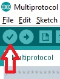
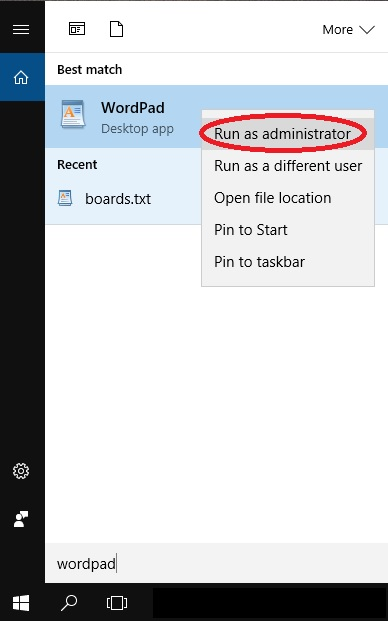

# Compiling and Programming (ATmega 328P)

Multiprotocol source are compiled using the well known Arduino IDE.

The procedure below will guide you through all the steps to upload successfully a customized firmware.

##Install the Arduino IDE and the Multiprotocol project firmware
1. Download and install the Arduino IDE. The currently supported Arduino version is 1.6.12. available for [Windows]( https://www.arduino.cc/download_handler.php?f=/arduino-1.6.12-windows.exe) and [Mac OSX](https://www.arduino.cc/download_handler.php?f=/arduino-1.6.12-macosx.zip)
1. It is recommended to upgrade Java to the [latest version](https://www.java.com/en/download/)
1. Download the zip file with the Multiprotocol module source code from [here](https://github.com/pascallanger/DIY-Multiprotocol-TX-Module/archive/master.zip)
1. Unzip and copy the source code folder **Multiprotocol** to a folder of your choosing
1. Click on the **Multiprotocol.ino** file in the **Multiprotocol** folder and the Arduino environment should appear and the Multiprotocol project will be loaded.

## Upload the firmware

###Material you need to upload the firmware
1. USBASP programmer supporting 3.3V:  [(example aliexpress link)](https://www.aliexpress.com/item/USBasp-USB-ISP-3-3V-5V-AVR-Programmer-USB-ATMEGA8-ATMEGA128-New-10PIN-Wire-Support/2036402518.html?spm=2114.30010308.8.10.jIbHzs). There are reports that some of the cheap programmers are not safe to use with 3.3V units, usually the black PCB versions are ok.
1. 10pin to 6pin adapter:  [(example ebay link)](http://www.ebay.fr/itm/10-Pin-a-6-Pin-Carte-Adaptateur-M-F-pour-AVRISP-USBASP-STK500-Noir-Bleu-WT-/291862396761?hash=item43f45abf59:g:gXsAAOSwMgdXyGnh)
1. 6 pin header like this one:  [(example Digi-Key link)](http://www.digikey.com/products/en?keywords=3M%20961206-6404-AR)

The 6 Pin header needs to be solder on the board like indicated by the red rectangle:
* Banggood readymade 4-in-1 module:

* DIY Mulitprotocol modules (like the 2.3d board):

* Arduino Pro Mini module:


###Connect the programmer

1. Before you connect the programmer make sure that you have selected the 3.3V mode and not 5V. The RF Modules are not 5V tolerant and you will break them with 5V.  On most programmers this is done by moving a jumper.

1. Please re-read item 1. above before going on.
1. Turn the rotary switch on the DIY Multiprotocol module to the 0 position. If you do not have a switch for Serial mode only then it is the same as being in the 0 position. The upload will not work if the switch is in any other position.
1. Connect the 6-pin programming connector to the 6-pin ASP IVR connector on the DIY Multiprotocol board. Be sure to match the ground pin of the programmer connector to the ground pin on the board.

The images below indicates the pin layout and the location of the ground pin on the board:
* Banggood readymade 4-in-1 module:

* DIY Mulitprotocol modules (like the 2.3d board):

* Arduino Pro Mini module:


You are now ready to plug in the USB programmer to the computer

If you are looking for a good working USBASP Windows driver, [use this one](http://www.protostack.com/download/USBasp-win-driver-x86-x64-v3.0.7.zip).

###Configure Arduino IDE for Multiprotocol
1. Under Tools -> Board select the Arduino Pro or Pro Mini
1. Under Tools -> Processor select the ATmega328 (5V, 16MHz)
1. Under Tools -> Programmer select your programmer type (probably USBASP from the shopping list above)

<a name="CustomizeFirmareToYourNeeds"></a>
###Customize the firmware to match your hardware and your needs
All customization is done by editing the ```_Config.h  ``` file in the Multiprotocol Arduino project.  

In the Arduino IDE, click on the down arrow on the far right of the tab bar to show a list of project files (see the red circle on the screenshot below).  Scroll down and select the _Config.h file.


The file has different sections which are explained in details. The best is to go through them one by one carefully and apply the configuration which matches your needs.

Most of the default settings should get you started quickly. But on modules with ATMega microcontrollers, the memory required for all the protocols exceeds the available 32KB of flash memory.  You therefore need to select which protocols you wish to use in order to fit them into the available memory.

To fill in the "PROTOCOLS TO INCLUDE" section, it would be good to review all the available protocols on the [Protocol Details](../Protocols_Details.md) page and identify which one you would like to add on your module.  

To check that the program will compile correctly and fit in the Atmega press the Check mark as shown below.



If you see something like the following, your firmware is still too big and you need to deselect additional protocols:
> Sketch uses 34,096 bytes (104%) of program storage space. Maximum is 32,768 bytes.
> Global variables use 1,236 bytes (60%) of dynamic memory, leaving 812 bytes for local variables. Maximum is 2,048 bytes.
> Sketch too big.

If there is another error carefully read it, go to the line number indicated and correct your typo.

###Flash the firmware

1. If you have a 4in1 Multiprotocol module you can skip this step. If you've just finished to build your DIY Multiprotocol module (like v2.3d), the first step is to flash the fuses of the microcontroller. This needs to be done only once. For this purpose, click on **Tools -> Burn Bootloader** 

1. You are now ready to flash the firmware.  In the Arduino IDE click **Sketch -> Upload Using Programmer**.

If the output indicates that the firmware has been uploaded successfully - give yourself a pat on the back.  Well done, you have successfully programmed your DIY Multiprotocol module. You can already go to the final step [Setting up your Transmitter](TransmitterSetup.md) and begin to fly!!!! But don't forget to visit the next topic [Advanced settings](#AdvancedSettings) which has some extra steps needed to use your module at his full potential.

**Troubleshooting**

If you get an error that indicates "warning : Can not Set sck period . usbasp please check for firmware update ." just ignore it, everything is fine.

If you get an error that indicates a valid microcontroller was not found there is something wrong with:
 - your connections, 
 - your programmer, or
 - your board

<a name="AdvancedSettings"></a>
## Advanced settings

So you followed the previous steps and your module is working.
Below are some extra steps which will:
 - Prevent the EEPROM from being erased each time the firmware is flashed. This will preserve your Tx ID and save you from having to rebind all your models after an update of the firmware.
 - Permit to flash even more protocols (extra 2KB)

### Arduino Boards.txt modification
First, we need to append some text to the Arduino file boards.txt.

#### On Windows
1. Close the Arduino IDE
1. Search Windows for the application WordPad (DO NOT USE Notepad). Right click on WordPad and select "Run as Administrator":

1. Open the file ```boards.txt``` located in this folder ```C:\Program Files(x86)\Arduino\hardware\arduino\avr ``` or the equivalent if you have installed Aduino in a different directory.
1. Append the following text into the end of the file and save it:

```
##############################################################
## Multi 4-in-1 (3.3V, 16 MHz) w/ ATmega328
## --------------------------------------------------
multi.name=Multi 4-in-1

multi.upload.tool=avrdude
multi.upload.protocol=arduino

multi.bootloader.tool=avrdude
multi.bootloader.unlock_bits=0x3F
multi.bootloader.lock_bits=0x0F

multi.build.board=AVR_PRO
multi.build.core=arduino
multi.build.variant=eightanaloginputs
multi.build.extra_flags=-Wl,--relax

multi.menu.cpu.16MHzatmega328=ATmega328 (3.3V, 16 MHz)

multi.menu.cpu.16MHzatmega328.upload.maximum_size=32768
multi.menu.cpu.16MHzatmega328.upload.maximum_data_size=2048
multi.menu.cpu.16MHzatmega328.upload.speed=57600

multi.menu.cpu.16MHzatmega328.bootloader.low_fuses=0xFF
multi.menu.cpu.16MHzatmega328.bootloader.high_fuses=0xD3
multi.menu.cpu.16MHzatmega328.bootloader.extended_fuses=0xFD

multi.menu.cpu.16MHzatmega328.build.mcu=atmega328p
multi.menu.cpu.16MHzatmega328.build.f_cpu=16000000L
##############################################################   
```

#### On Mac OSX:
1. Close the Arduino IDE
1. Using finder navigate to ```Applications``` folder
1. Ctl-Click on the Arduino application and select **Show Package Contents**.
1. Browse to ```Contents/Java/hardware/arduino/avr`` and double click on boards.txt
1. Copy and paste the "Multi 4-in-1" text listed above into the end of the file and save it.

### Burn Bootloader
1. Open the Arduino IDE and load the Multiprotocol project.
1. Select under **Tools -> Board** the new entry **Multi 4-in-1**
1. Select under **Tools -> Programmer** the entry **USBasp**
1. Click on **Tools -> Burn Bootloader**.  Do not worry it will return an error that no bootloader was found. In fact we are interrested by the first few lines indicating that the fuses were set correctly.
1. At this stage your flash module is empty so it's normal if the status LED does not do anything.

### Flash the firmware
Scroll back to the section [Customize the firmware to your hardware and your needs](#CustomizeFirmareToYourNeeds) above and follow the instructions.

You are done good fly!!!
