# Compiling and Programming (STM32)

Multiprotocol firmware is compiled using the Arduino IDE. The guide below will walk you through all the steps to compile and upload your customized firmware.

**These instructions are for the STM32 version of the Multiprotocol module.**  If you are Compling for the Arduino ATmega328p version of the Multiprotocol Module please go to the dedicated [ATmega328](Compiling.md) page.

## Index
1. [Tools Required](#tools-required)
1. [Preparation](#preparation)
   1. [Install the Arduino IDE](#install-the-arduino-ide)
   1. [Download the Multiprotocol source and open the project](#download-the-multiprotocol-source-and-open-the-project)
   1. [Install the Multi 4-in-1 board](#install-the-multi-4-in-1-board)
   1. [Configure the Arduino IDE](#configure-the-arduino-ide)
1. [Configure the firmware](#configure-the-firmware)
1. [Verify the firmware](#verify-the-firmware)
1. [Preparing to upload the firmware](#preparing-to-upload-the-firmware)
   1. [Connect the programmer](#connect-the-programmer)
   1. [Select an upload method](#select-an-upload-method)
   1. [Burn the bootloader](#burn-the-bootloader)
1. [Uploading the firmware](#uploading-the-firmware)
      1. [Flash from TX](#flash-from-tx)
      1. [Upload via USB](#upload-via-usb)
         1. [Install the Maple USB Drivers](#install-the-maple-usb-drivers)
         1. [Upload the firmware via USB](#upload-the-firmware-via-usb)
      1. [Upload via Serial](#upload-via-serial)
1. [Precompiled Binaries](#flashing-pre-compiled-binaries)
1. [Troubleshooting](#troubleshooting)

## Tools required

| **3.3V USB-TTL Adapter** | **4-pin Serial Programming Header** |
|:---:|:--:|
| 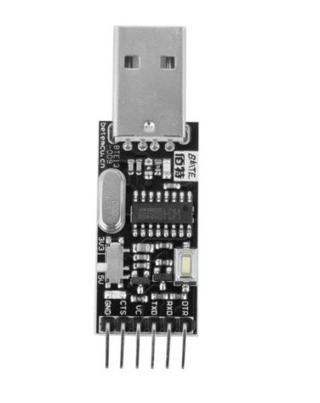 | 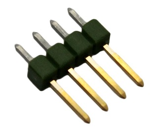 
| [(example ebay link)](https://www.ebay.co.uk/itm/FTDI-USB-to-TTL-Serial-Converter-Adapter-FT232RL-Module-5V-and-3-3V-Arduino-ARM/231918152528) | [(example ebay link)](https://www.ebay.co.uk/itm/4x-826629-4-Pin-header-pin-strips-AMPMODU-MOD-II-male-PIN4-straight/192334571714) |

The USB-TTL adapter can be either FTDI or CH340G, as long as it works.  It should have a switch or jumper to select 3.3V or 5V, which **must** be set to **3.3V**.

The 4-pin header needs to be soldered onto the board as indicated by the red rectangle:

| **DIY Multiprotocol Module** | **Banggood 4-in-1 Module** | **iRangeX IRX4 Plus Module** |
|:---:|:---:|:---:|
| 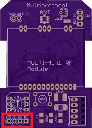 | 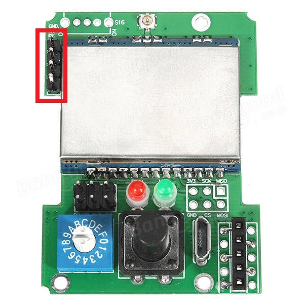 | 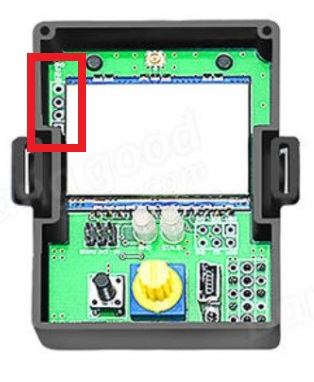 |

**Note:** The Banggood STM32 module most likely already has the header pin in place.

## Preparation
### Install the Arduino IDE
1. Download and install the Arduino IDE. The currently supported Arduino version is 1.8.5, available for [Windows]( https://www.arduino.cc/download_handler.php?f=/arduino-1.8.5-windows.exe) and [Mac OSX](https://www.arduino.cc/download_handler.php?f=/arduino-1.8.5-macosx.zip)
1. It is recommended to upgrade Java to the [latest version](https://www.java.com/en/download/)

### Download the Multiprotocol source and open the project
1. Either
   1. Download the zip file with the Multiprotocol module source code from [here](https://github.com/pascallanger/DIY-Multiprotocol-TX-Module/archive/master.zip) and unzip and copy the source code folder **Multiprotocol** to a location of your choosing, or
   1. Clone the project using Git or Github Desktop, then
1. Double-click the **Multiprotocol.ino** file in the **Multiprotocol** folder to open the project in the Arduino IDE

### Install the Multi 4-in-1 board
1. Follow [these instructions](/BootLoaders/README.md) to install the **Multi 4-in-1 STM32 Board** in the Arduino IDE

### Configure the Arduino IDE
1. Under **Tools -> Board** select **Multi 4-in-1 (STM32FC103)**
1. Under **Tools -> Programmer** select **stm32flash (FTDI)**

## Configure the firmware
The STM32 module has more than enough flash space for all the available protocols so, unlike the Atmega328p-based module, it is not necessary to disable unused protocols.

You can still disable protocols if you wish, and you may also enable or disable other optional Multiprotocol features.
## Verify the firmware
To check that the program will compile correctly and fit in the Atmega click **Sketch -> Verify/Compile**, or press **Ctrl+R**.

If there are errors,  carefully read it, go to the line number indicated and correct your typo.

If there are no errors and you see output like this:
```
Sketch uses 68564 bytes (52%) of program storage space. Maximum is 131072 bytes.  
Global variables use 4064 bytes (19%) of dynamic memory, leaving 16416 bytes for local variables. Maximum is 20480 bytes.
```
You can proceed to the next step.

## Preparing to upload the firmware
If you have already burned the bootloader, and are simply recompiling firmware to re-flash using your TX or USB cable, you can skip this step and go straight to [Flash from TX](#flash-from-tx) or [Upload via USB](#upload-via-usb).

### Select an Upload Method
There are three methods to upload firmware to an STM32 module:
* **Flash from TX** - highly recommended, uses maintenance mode in radios running ersky9x to upload the firmware
* **Upload via USB** - uses the USB port on the module
* **Upload via Serial (FTDI)** - uses the serial interface on the module via a USB-to-TTL adapter

**Note:** 'Flash from TX' is only available with radios running ersky9x r221e2 or newer

**Flash from TX** is highly recommended if your transmitter supports it, **Upload via USB** is recommended for all others.  **Upload via Serial** can be used if your module does not have a working USB port and your transmitter does not run ersky9x.

1. Under **Tools -> Upload Method** select an upload method

The rest of this process will vary depending on the upload method you selected.

### Connect the programmer
It is **strongly** recommended that you power your module from the transmitter when flashing it. This ensures that the module cannot be inadvertently supplied with 5V, which will damage the RF modules. This guide assumes that you will follow that advice, and instructs you to leave the V+ pin on the USB-to-TTL adapter disconnected. You may choose to ignore that advice at your own risk!

The wiring for the USB-to-TTL adapter is:
* USB-to-TTL TX pin <-> Module RX pin
* USB-to-TTL RX pin <-> Module TX pin
* USB-to-TTL GND pin <-> Module GND pin
* USB-to-TTL VC pin <-> **Not Connected**

**It is critical to ensure that the USB-to-TTL adapter is set to 3.3V**.

| **DIY Multiprotocol Module** | **Banggood 4-in-1 Module** | **iRangeX IRX4 Module** |
|:---:|:---:|:---:|
| 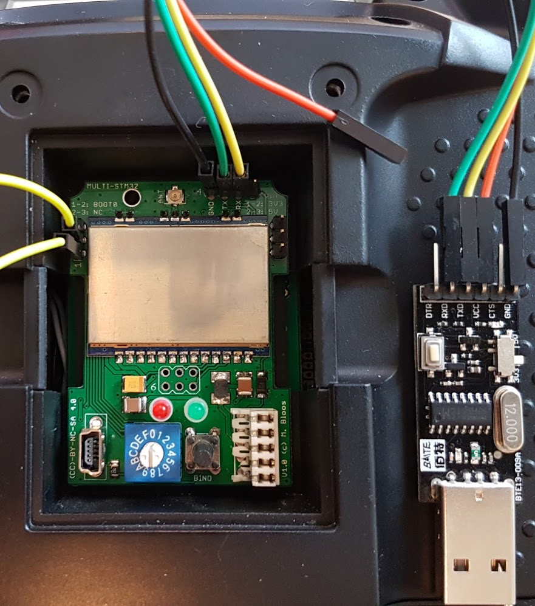 | 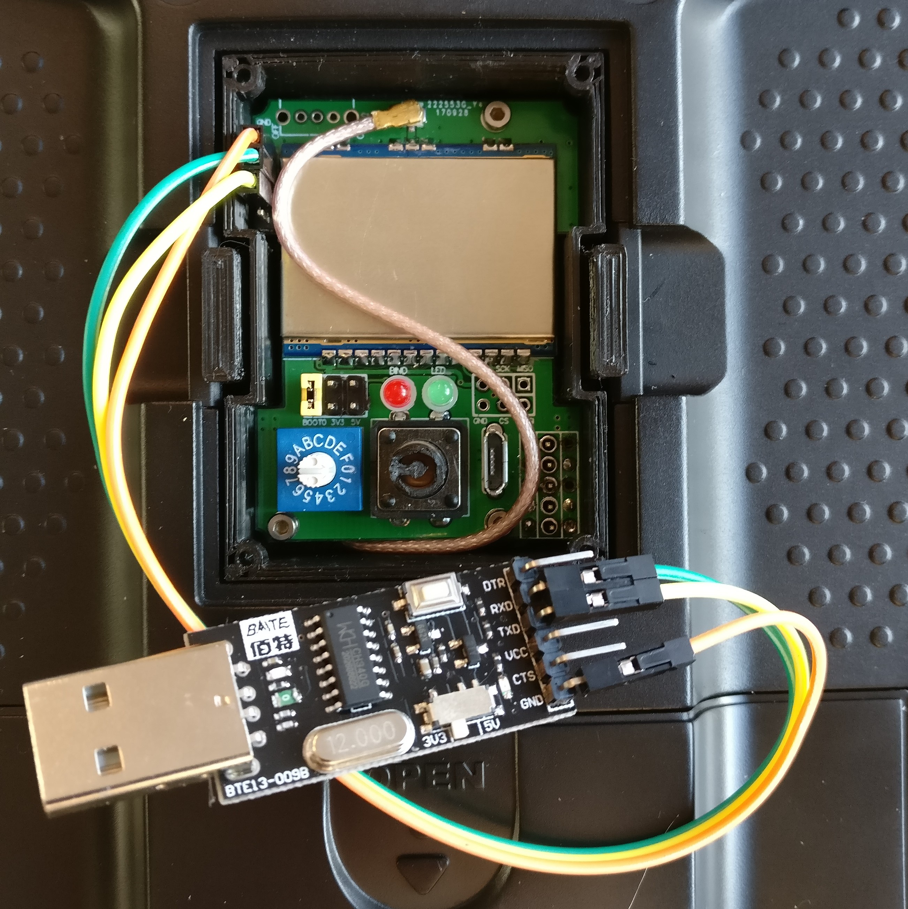 | 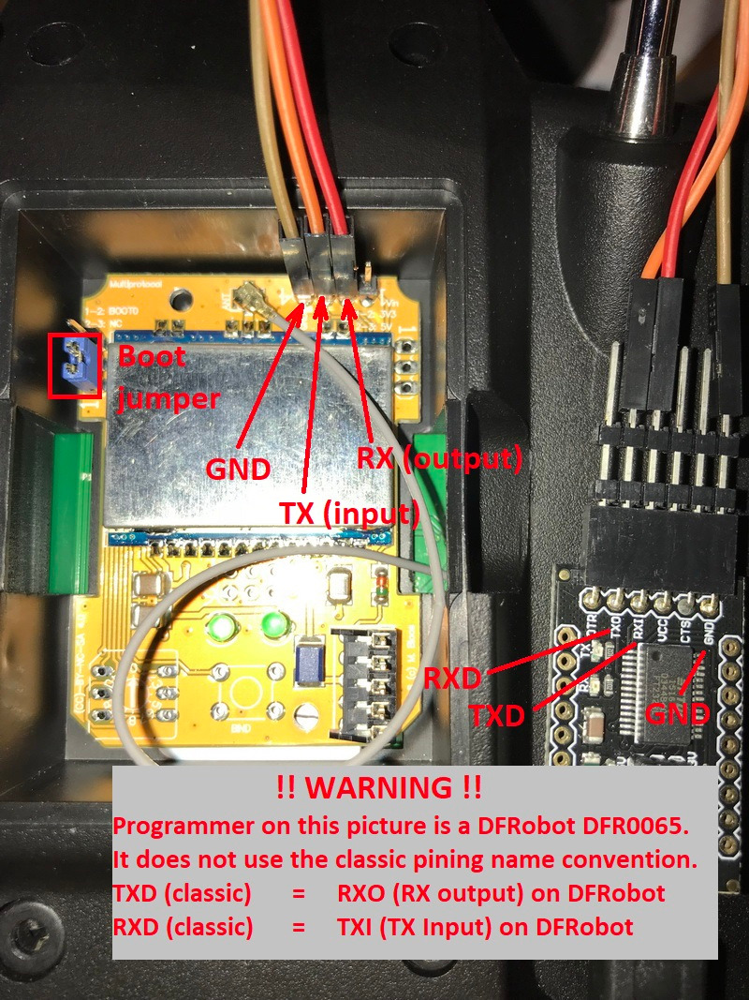 |

1. Put the module in the transmitter
1. Connect the USB-to-TTL adapter to the module as described above
1. Plug the USB-to-TTL adapter into the PC
1. In the Arduino IDE click **Tools -> Port** and choose the COM port which matches the USB-to-TTL adapter

### Burn the bootloader
If you are using **Upload via Serial** you can skip this step and proceed to [Upload via Serial](#upload-via-serial).

If you have selected either **Flash from TX** or **Upload via USB** the module will need to install the appropriate bootloader, which is selected automatically based on the Upload Method selection.

The bootloader only needs to be installed once unless you decide to switch from one upload method to the other.  

In order to flash the bootloader the **BOOT0** jumper must be installed.  The location of **BOOT0** varies by hardware module.

| **DIY Multiprotocol Module** | **Banggood 4-in-1 Module** | **iRangeX IRX4 Module** |
|:---:|:---:|:---:|
| Bridge pins 1 and 2 as shown by the yellow jumper wire. | Bridge the left-most pins of the 6-pin header as shown by the yellow jumper. | Bridge pins 1 and 2 as shown by the blue jumper. |
|  | 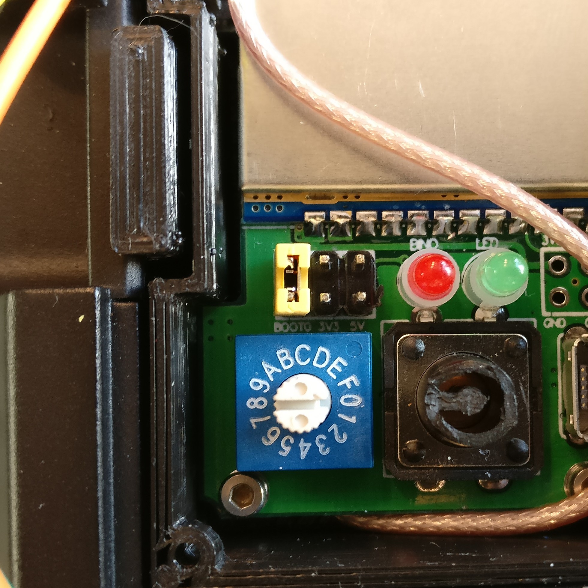  | 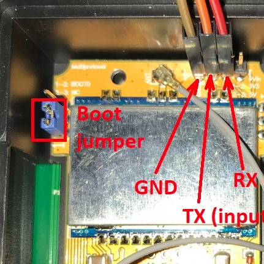  |

1. Install the **BOOT0** jumper as described above
1. Switch on the transmitter
1. Verify that you have selected the desired upload method under **Tools -> Upload Method**
1. Verify that you have selected **stm32flash (FTDI)** as the programmer under **Tools -> Programmer**
1. Verify that the USB-to-TTL adapter is correctly connected to your module and you have selected the correct port under **Tools -> Port**
1. Click on **Tools -> Burn Bootloader** 

Output will look similar to this:
```
C:\Users\blye\AppData\Local\Arduino15\packages\multi4in1\hardware\STM32F1\1.0.0/tools/win/serial_upload.bat COM4 0x0 C:\Users\blye\AppData\Local\Arduino15\packages\multi4in1\hardware\STM32F1\1.0.0/bootloaders/Multi4in1/StmMultiUSB.bin 
stm32flash -v -g 0x0 -b 57600 -w C:\Users\blye\AppData\Local\Arduino15\packages\multi4in1\hardware\STM32F1\1.0.0\bootloaders\Multi4in1\StmMultiUSB.bin COM4 

stm32flash 0.4

http://stm32flash.googlecode.com/

Using Parser : Raw BINARY
Interface serial_w32: 57600 8E1
Version      : 0x22
Option 1     : 0x00
Option 2     : 0x00
Device ID    : 0x0410 (Medium-density)
- RAM        : 20KiB  (512b reserved by bootloader)
- Flash      : 128KiB (sector size: 4x1024)
- Option RAM : 16b
- System RAM : 2KiB
Write to memory
Erasing memory

Wrote and verified address 0x08000100 (3.56%) 
Wrote and verified address 0x08000200 (7.13%) 
...
Wrote and verified address 0x08001c00 (99.78%) 
Wrote and verified address 0x08001c10 (100.00%) Done.

Starting execution at address 0x08000000... done.
```
Assuming the process is successful:
1. Power off the transmitter
1. Remove the **BOOT0** jumper
1. Disconnect the USB-to-TTL adapter

## Uploading the firmware
Follow the instructions which apply to the **Upload method** you previously selected.
* [Flash from TX](#flash-from-tx)
* [Upload via USB](#upload-via-usb)
* [Upload via Serial](#upload-via-serial)

## Flash from TX
1. Click **Sketch -> Export compiled Binary**, or press **Ctrl+Alt+S**
1. Locate the file named **multifw.bin** in the **Multiprotocol** folder
1. Follow the instructions [here](/docs/Flash_from_Tx.md) to upload the firmware using your radio

## Upload via USB
The **Upload via USB** bootloader enables your PC to detect the Multiprotocol module as a **Maple DFU** device.  It will not be detected as a USB serial device until the firmware is uploaded to it, when it will be detected as a **Maple Serial** device.  

In order for these devices to be correctly identified in Windows it is necessary to install drivers.  This only needs to be done once.

### Install the Maple USB drivers
##### Windows 7 or newer:
1. Open the folder where you unzipped or cloned the Multiprotocol project
1. Browse to **\BootLoaders\Boards\stm32\drivers**
1. Run **install-drivers.bat**
1. Follow the prompts to install the two drivers

##### Windows XP or older
1. Download and install the legacy Windows XP drivers from [here](https://github.com/rogerclarkmelbourne/Arduino_STM32/tree/master/drivers/win/win_xp_legacy)

**NOTE:** If you have installed the drivers and your module is not detected as a Maple device it most likely does not have a USB bootloader installed. Ready-made modules from Banggood **do not** come with a USB bootloader installed.  You will need to follow the procedure to [Burn a USB bootloader](#burn-the-bootloader) before you can upload firmware.

### Upload the firmware via USB
**Note:** Power to the module will be supplied via the USB cable.  If the module is installed in a transmitter, the transmitter should be switched off.

1. Connect the USB cable to the Multiprotocol module
1. Verify that a Maple device appears in Device Manager (**Maple DFU** for a module with only a bootloader, **Maple Serial** for a module with a bootloader and firmware)
1. In the Arduino IDE click **Sketch -> Upload**, or press **Ctrl+U**

You should see output similar to this:
```
Sketch uses 68564 bytes (52%) of program storage space. Maximum is 131072 bytes.
Global variables use 4064 bytes (19%) of dynamic memory, leaving 16416 bytes for local variables. Maximum is 20480 bytes.
C:\Users\blye\AppData\Local\Arduino15\packages\multi4in1\hardware\STM32F1\1.0.0/tools/win/maple_upload.bat COM4 2 1EAF:0003 C:\Users\blye\AppData\Local\Temp\arduino_build_933551/Multiprotocol.ino.bin 
maple_loader v0.1
Resetting to bootloader via DTR pulse
Reset via USB Serial Failed! Did you select the right serial port?
Searching for DFU device [1EAF:0003]...
Assuming the board is in perpetual bootloader mode and continuing to attempt dfu programming...

Found it!

Opening USB Device 0x1eaf:0x0003...
Found Runtime: [0x1eaf:0x0003] devnum=1, cfg=0, intf=0, alt=2, name="STM32duino bootloader v1.0  Upload to Flash 0x8002000"
Setting Configuration 1...
Claiming USB DFU Interface...
Setting Alternate Setting ...
Determining device status: state = dfuIDLE, status = 0
dfuIDLE, continuing
Transfer Size = 0x0400
bytes_per_hash=1371
Starting download: [##################################################] finished!
state(8) = dfuMANIFEST-WAIT-RESET, status(0) = No error condition is present
Done!
Resetting USB to switch back to runtime mode
error resetting after download: usb_reset: could not reset device, win error: The system cannot find the file specified.
```

**Note:** The line `Reset via USB Serial Failed! Did you select the right serial port?` is expected because the uploader initially looks for a Maple Serial device, which isn't yet available, before failing back to Maple DFU.  That error only appears the first time and won't appear when re-flashing firmware.  The final line warning, stating that the device could not be reset, is also expected.

For subsequent firmware uploads you need only repeat steps 1-3 above, ensuring that you first select the correct COM port, which should be labelled **COMx (Multi 4-in-1 (STM32F103CB))**.

<p align="center">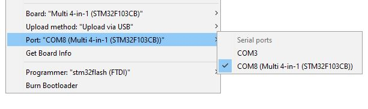</p>

If the module is installed in a transmitter, disconnect the USB cable before powering on the transmitter.

## Upload via Serial
Upload via Serial follows the same process as burning the bootloader and uses the same USB-to-TTL adapter.

1. Ensure you USB-to-TTL adapter is connected as described in [Connect the programmer](#connect-the-programmer)
1. Install the **BOOT0** jumper
1. Turn on the transmitter
1. Click **Sketch -> Upload**

You should see output similar to this:
```
Sketch uses 62772 bytes (47%) of program storage space. Maximum is 131072 bytes.
Global variables use 3216 bytes (15%) of dynamic memory, leaving 17264 bytes for local variables. Maximum is 20480 bytes.
C:\Users\blye\AppData\Local\Arduino15\packages\multi4in1\hardware\STM32F1\1.0.0/tools/win/serial_upload.bat COM4 0x8000000 C:\Users\blye\AppData\Local\Temp\arduino_build_868436/Multiprotocol.ino.bin 
stm32flash -v -g 0x8000000 -b 57600 -w C:\Users\blye\AppData\Local\Temp\arduino_build_868436\Multiprotocol.ino.bin COM4 

stm32flash 0.4

http://stm32flash.googlecode.com/

Using Parser : Raw BINARY
Interface serial_w32: 57600 8E1
Version      : 0x22
Option 1     : 0x00
Option 2     : 0x00
Device ID    : 0x0410 (Medium-density)
- RAM        : 20KiB  (512b reserved by bootloader)
- Flash      : 128KiB (sector size: 4x1024)
- Option RAM : 16b
- System RAM : 2KiB
Write to memory
Erasing memory

Wrote and verified address 0x08000100 (0.41%) 
Wrote and verified address 0x08000200 (0.82%) 
... 
Wrote and verified address 0x0800f500 (99.92%) 
Wrote and verified address 0x0800f534 (100.00%) Done.

Starting execution at address 0x08000000... done.
```

Once the firmware has uploaded, remove the **BOOT0** jumper and disconnect the USB-to-TTL adapter.

## Flashing pre-compiled binaries
Pre-compiled binaries are availale [here](https://github.com/pascallanger/DIY-Multiprotocol-TX-Module/releases).
- **Multiprotocol_V1.X.X_STM32.bin** files are for transmitters with support for hardware telemetry inversion, such as Turnigy 9X, 9XR, 9X+.
- **Multiprotocol_V1.X.X_STM32_INV.bin** files are for tranismitters which require telemetry inverted in the module firmware, such as Taranis.

If you want to flash a pre-compiled binary file (like the Release .bin files) you will use the same USB-to-TTL adapter as [above](#connect-the-programmer).  

You will also need to download the **ST Flash Loader Demonstrator** from [here](http://www.st.com/content/st_com/en/products/development-tools/software-development-tools/stm32-software-development-tools/stm32-programmers/flasher-stm32.html)

Run the **ST Flash Loader Demonstrator** program. There are many tutorials on the web on how to use this program, for example [here](http://www.scienceprog.com/flashing-programs-to-stm32-embedded-bootloader).

## Troubleshooting
You can report your problem using the [GitHub issue](https://github.com/midelic/DIY-Multiprotocol-TX-Module/issues) system or go to the [Main thread on RCGROUPS](http://www.rcgroups.com/forums/showthread.php?t=2165676) to ask your question.
Please provide the following information:

- Multiprotocol code version
- STM32 version
- TX type
- Using PPM or Serial, if using er9x or ersky9x the version in use
- Different led status (multimodule and model)
- Explanation of the behavior and reproduction steps
