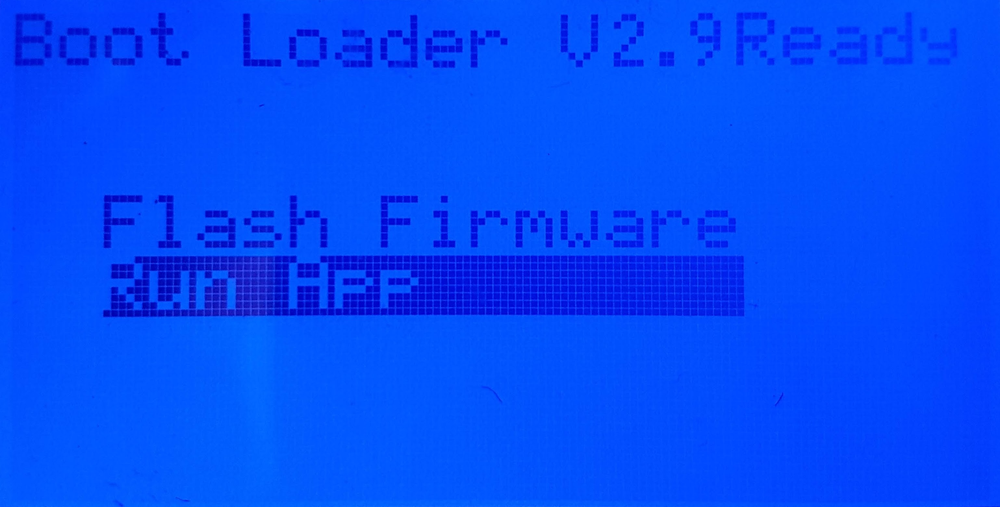
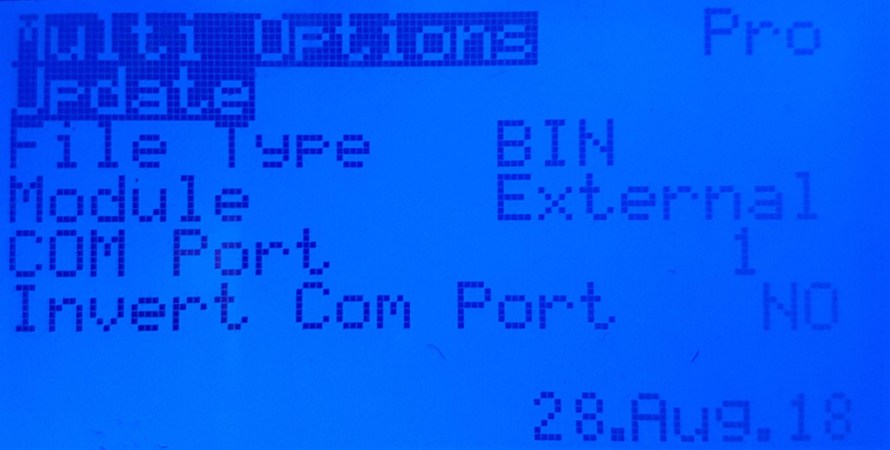

# Flashing from the Transmitter

For radios running erskyTx and OpenTX, there is an option to flash a precompiled firmware file to the multiprotocol module:
- OpenTX: using the SD card browser
- erskyTX : using the transmitter's Bootloader mode.

What you need:
* A precompiled multiprotocol firmware file (.hex for Atmega328p or .bin for STM32)
* A **Flash from TX** bootloader installed on an Atmega328p or STM32 multiprotocol module
* A means to get the firmware file onto the transmitter's SD card

## OpenTX 2.3.3 or newer
1. Copy the firmware file to the radio's SD card - it doesn't matter where you put it
1. Switch the radio on normally and use the radio menu to locate the file on the SD card
1. Highlight the file and press the ENTER button
1. Choose Flash internal module or Flash external module as appropriate

## erskyTX

### How to check the bootloader version
1. Push both horizontals trims inwards (close to each others) while powering on the radio
1. The screen title should indicate `Boot Loader V2.9Ready` or newer

1. Launch the `FlashMulti_xxx.app` app from the `Run App` menu
1. The App version at the bottom right of the screen should be `28.Aug.18` or newer

1. If everything is correct you are ready to upgrade the Multimodule firmware

### Upgrade the bootloader and install app(s)
1. Download the latest zip file of the [erskyTx firmware](https://openrcforums.com/forum/viewtopic.php?f=7&t=4676) or [this file for the T16](http://www.er9x.com/t16BootFlashMulti.zip).
1. Extract the .bin file corresponding to your radio in your SD card `\FIRMWARE` directory
1. Download the latest [Flash Multiprotocol Module app](http://www.er9x.com/Ersky9xapps.html) for your radio. For the T16, it's in the previous file.
1. Copy the .app file in a folder called `APPS` at the root of the SD card (if the directory does not exist create it)
1. For erskyTx
   1. Power on the radio in `MAINTENANCE` mode while pushing both horizontals trims outwards (away from each others)
   1. Select `Update Bootloader`
   1. Select the ersky9x firmware matching your radio
   1. Long press it and select `Flash bootloader`
1. For OpenTX
   1. Boot the radio normaly
   1. Go in the `RADIO SETUP` menu page 2 called `SD-HC CARD`
   1. Open the `FIRMWARE` directory
   1. Select the ersky9x firmware matching your radio
   1. Long press it and select `Flash bootloader`
1. Check by rebooting the radio in bootloader mode that everything is [ok](###-How-to-check-the-bootloader-version)

### Multimodule upgrade procedure
1. Either:
   1. Connect the transmitter using a USB cable and power it on, or 
   1. Remove the SD card from the transmitter and mount it using a suitable reader
1. Copy the pre-compiled firmware file into the `\FIRMWARE` folder of the SD card (create the folder if it does not exist)
1. Power the transmitter off and remove the USB cable or put the SD card back in the transmitter
1. Push both horizontals trims inwards (close to each others) while powering on the radio
1. The screen title should indicate `Boot Loader V2.9Ready` or newer
1. Launch the `FlashMulti_xxx.app` app from the `Run App` menu
1. Choose the appropriate file type
   1. `HEX` to update an Atmega328p module
   1. `BIN` to update an STM32 module
1. Select `Update`
1. Choose the firmware file to flash, long press to select it
1. Long press again to flash the selected file to the module
1. When flashing has finished, long press EXIT to reboot in normal mode

### Troubleshooting
1. If the flashing procedure fails try to redo the process with `Invert Com Port` enabled
1. Make sure to have the latest bootloader on the MPM module before attempting to Flash from the TX:
   1. For an Atmega328p module use the bootloader bundled with the `Multi 4-in1 AVR board 1.0.3` or later 
   1. For a STM32 module use the bootloader bundled with the `Multi 4-in1 STM32 board 1.0.9` or later
