# Multiprotocol Module Hardware Options

This project started as a DIY effort, with all hardware being scratch-built.  While building your own hardware is still an option (and all the details for doing it are here in the documentation) there are now multiple ready-made modules available to purchase for around US$30-40.

**Note:** This project is not affiliated or associated with any manufacturer of Multiprotocol modules.  They are typically produced by Chinese manufacturers who took the intellectual property from this project and produced the modules for profit, with no consideration given to the original inventors.  While this is beneficial to hobbyists and consumers as it makes the modules easy to obtain, it is frustrating for the original developers.  Please bear that in mind if asking for help or support.

## Hardware
The Multiprotocol hardware essentially consists of a PCB, a microprocessor, and a 4-in-1 RF module.  

Original scratch-built modules were based on an Arduino Pro-Mini, which shares the same Atmega328p 8-bit microprocessor, with 32KB of flash, as the later Atmega328p PCB modules.  With only 32KB of flash the original modules could not support all of the available protocols and builders had to choose to enable and disable protocols when building the firmware.

The current state-of-the-art module is based on a 32-bit ARM Cortex-M3 microcontroller, with 128KB of flash and 20KB of RAM. The STM32 modules are only just over half full with all protocols enabled.  For this reason an STM32 module is highly recommended.

## DIY Modules
The details for the DIY projects can be found [here](Module_Build_yourself_PCB.md). You should be competent and confident with a soldering iron to attempt this, and have the tools to troubleshoot it if there are problems.

| **Scratch-built Atmega328p** | **DIY Atmega328p PCB Module** | **DIY STM32 PCB Module** |
| :---: | :---: | :---: |
| 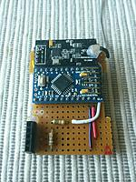 | 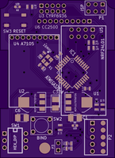 |  |

For most people, purchasing a ready-made module is the best option.

## Ready-made Modules
These are examples of the well-known ready-made Multiprotocol modules.  Inclusion in this list is not an endorsement or recommendation.  The list is in no particular order

| **Module** | **Image** | **MCU** | **Approx. Cost** | **Notes** | **Link** |
| :---: | :---: | :---: | :---: | :--- | :--- |
| **'Banggood' 4-in-1 Atmega328p** | 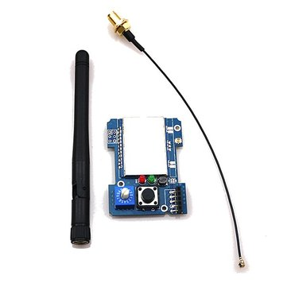 | [Atmega328p](Compiling.md "Firmware compiling and uploading instructions for Atmega328p") | US$32 | <ul><li>Limited flash space</li><li>No case included</li><li>Serial and PPM</li></ul> | [Banggood](https://www.banggood.com/2_4G-CC2500-A7105-Flysky-Frsky-Devo-DSM2-Multiprotocol-TX-Module-With-Antenna-p-1048377.html) |
| **'Banggood' 4-in-1 STM32** | 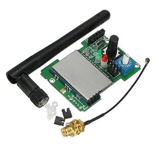 | [STM32F103C](Compiling_STM32.md "Firmware compiling and uploading instructions for STM32") | US$37 | <ul><li>No case included</li><li>Serial and PPM</li></ul> | [Banggood](https://www.banggood.com/2_4G-CC2500-NRF24L01-A7105-CTRF6936-4-IN-1-Multi-protocol-STM32-TX-Module-With-Antenna-p-1153902.html) |
| **iRangeX IRX4 STM32** | 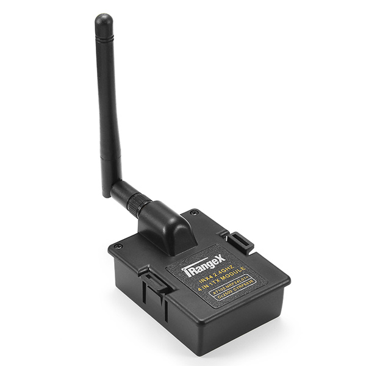 | [STM32F103C](Compiling_STM32.md "Firmware compiling and uploading instructions for STM32") | US$39 | <ul><li>Includes case</li><li>Serial mode only</li></ul> | [Banggood](https://www.banggood.com/IRangeX-IRX4-2_4G-CC2500-NRF24L01-A7105-CTRF6936-4-IN-1-Multiprotocol-STM32-TX-Module-With-Case-p-1197130.html) |
| **iRangeX IRX4 Plus STM32** | 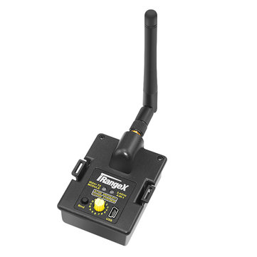 | [STM32F103C](Compiling_STM32.md "Firmware compiling and uploading instructions for STM32") | US$37 | <ul><li>Includes case</li><li>Has USB port and LED</li><li>Serial and PPM</li></ul> | [Banggood](https://www.banggood.com/IRangeX-IRX4-Plus-2_4G-CC2500-NRF24L01-A7105-CYRF6936-4-IN-1-Multiprotocol-STM32-TX-Module-With-Case-p-1225080.html) |

*Table last updated November 29th, 2017*

#### OrangeRx Module
It is also possible to upload the Multiprotocol firmware to an STM32-based OrangeRx DSM module, with support only for the built in CYRF6936 RF module.

When flashed with with Mulitprotocol firmware, the OrangeRx:
* Operates in serial mode only
* Works with all DSM bind-and-fly models
* Supports the Devo protocols
* Supports the J6Pro protocols
* Supports the Walkera protocols

**Note:** With the availability of better equipped ready-made 4-in-1 modules the OrangeRx is not a recommended option, and is included here for completeness.

## Module Cases
Whether DIY or ready-made, your module will need a case.  You may buy a module which comes with a case, a module and a separate case, or you can 3D-print your own case.

**Note:** Make sure you select a case which is compatible with your module PCB - the Atmega328p and STM32 boards have the screws in different positions.

### Ready-made Cases
You can buy a ready-made case from Banggod for a few dollars:  
<a href="https://www.banggood.com/Multi-Protocol-TX-Transmitter-Module-Case-for-FrSky-FlySky-Transmitter-p-1085320.html">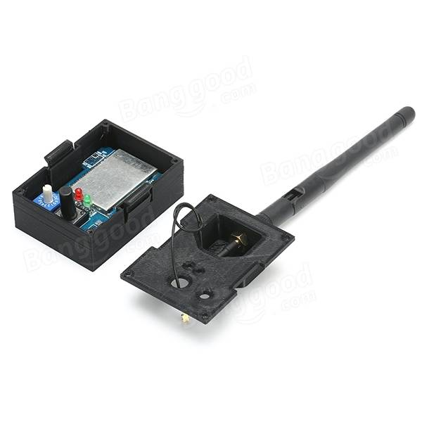

### DIY 3D Printed Cases
Some examples of the Multiprotocol module cases which are available on Thingiverse:

  
| <a href="https://www.thingiverse.com/thing:1992057">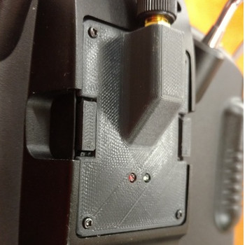</a> | <a href="https://www.thingiverse.com/thing:2446111">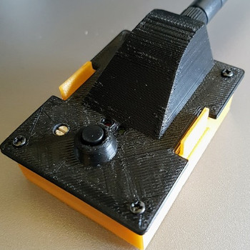 | <a href="https://www.thingiverse.com/thing:1852868">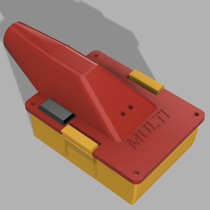</a>| 
|:---:|:---:|:---:|
  

More are available if you [search Thingiverse](https://www.thingiverse.com/search?q=multi+protocol+case).  

#### Turnigy 9XR Internal Antenna Case
For Turnigy 9XR and 9XR Pro owners, there is a case which allows the Multiprotocol module to connect to the internal antenna, which means nothing is sticking out of the radio back.

  
 | <a href=http://www.thingiverse.com/thing:2050717>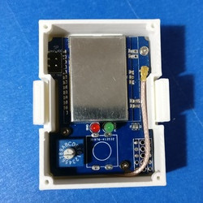</a> | <a href=http://www.thingiverse.com/thing:2050717>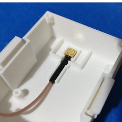</a>  | <a href=http://www.thingiverse.com/thing:2050717>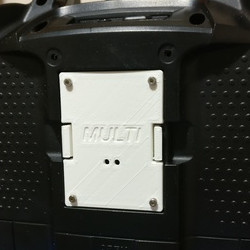</a> |
| :---: | :---: | :---: |

You can also find this case on [Thingiverse](http://www.thingiverse.com/thing:2050717).

---
#### Multiprotocol Support
The main support forum for the Multiprotocol Module is [this](https://www.rcgroups.com/forums/showthread.php?2165676-DIY-Multiprotocol-TX-Module/) RCGroups forum thread.  Support is provided for DIY hardware, firmware configuration, compilation and uploading, and using the RF protocols.  Support is *not* provided for hardware problems with ready-made modules (you should contact the vendor/manufacturer).

#### Donations
The Multiprotocol firmware is provided for free under the [GNU General Public License v3.0](https://github.com/pascallanger/DIY-Multiprotocol-TX-Module/blob/master/LICENSE).  The developers do not receive any payment from any of the manufacturers of Multiprotocol Modules which use this firmware.

If you like this project and enjoy using it, please consider [making a donation](Donations.md).  Donations are used to fund test hardware to develop and integrate more models.
