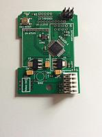
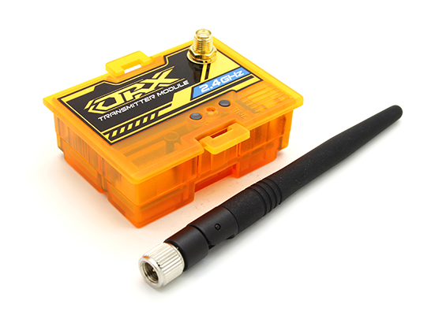
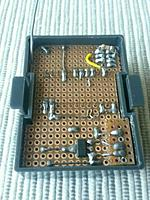

# Hardware Options for your MULTI-Module

The choice of **Multiprotocol Transmitter Module (MULTI-Module)** hardware is the single biggest choice you will make.  Due to the growing popularity of this project the number of hardware choices is growing almost monthly.  

There are currently four common hardware options.  They are (click on the pictures for more info):

1. A ready-made MULTI-Module from Banggood.com (see [here](http://www.banggood.com/2_4G-CC2500-A7105-Flysky-Frsky-Devo-DSM2-Multiprotocol-TX-Module-With-Antenna-p-1048377.html)) that integrates the microprocessor with all four supported RF modules and a hardware antenna switcher.  

1. A DIY MULTI-Module made using one of the PCBs that are available and soldering on your own components. The picture below shows an example of one before RF modules have been soldered on.  

1. A MULTI-Module based on the OrangeRx DSM transmitter module that natively supports the CYRF6936 RF module. This module can be improved with Mulitprotocol firmware:  
   - Now works with most (all) DSM bind-and-fly models  
   - Supports the Devo protocols
   - Supports the J6Pro protocols   

1. A scratchbuilt MULTI-Module using perfboard, an Arduino Pro-Mini and the desired RF modules.
Unless you are handy with a soldering iron and you have access to electronic test equipment (like an oscilloscope) you should consider only Option 1.  For a price of about $44 you can get everything you need, neatly assembled 

Click on any of the images above to understand more about each option.

