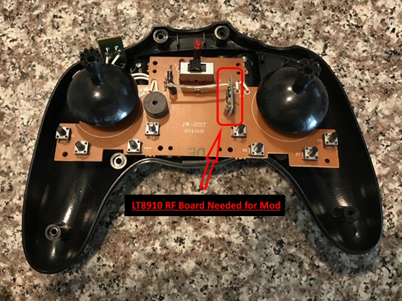
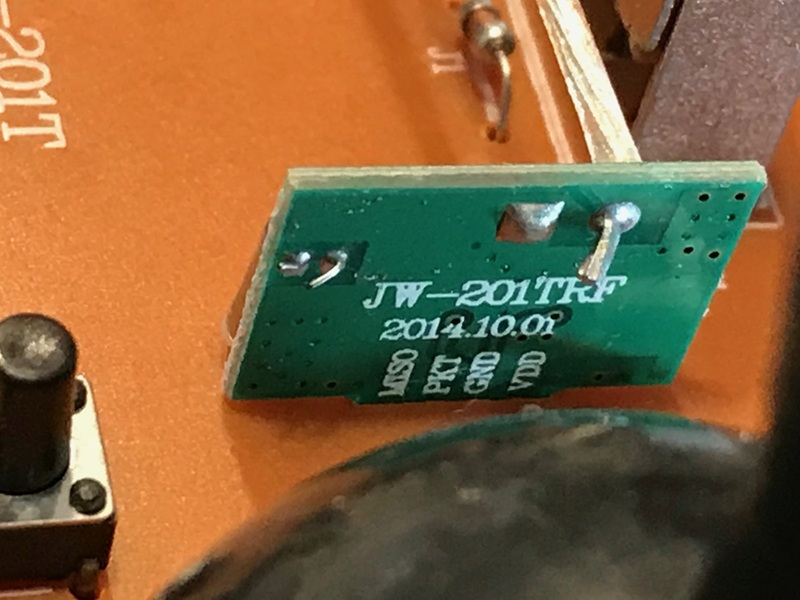
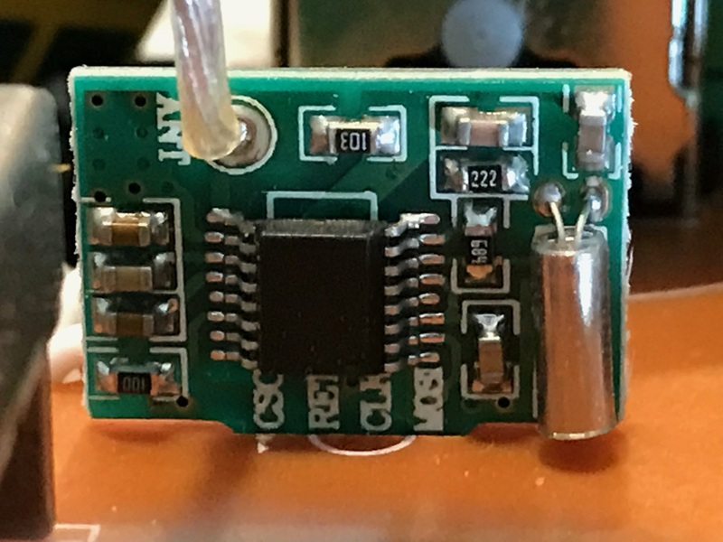

# CG022 / LT8910 Protocol Implementation

## Executive Summary

This document summarizes the final, working CG022 implementation for the DIY Multiprotocol TX Module using an external LT8910 RF board.

**Status:** ✅ **WORKING**

Validated behavior:
- successful bind and control with the CG022 receiver
- LT8910 hardware reset driven from `PA14` (`LT8910_RST_pin`)
- SPI Mode 1 (`CPOL=0`, `CPHA=1`) at `/256` (~140kHz)
- 8-channel hop sequence with ~2310µs hop period
- correct bind/data payload format and checksums
- rate modes `0x00` / `0x11` / `0x22` for 20% / 60% / 100%

---

## 1. Hardware Setup

### 1.1 Target Hardware
- **MPM Board:** STM32F103-based Multiprotocol TX Module
- **RF Module:** external LT8910/LT8900 RF board
- **Connection:** MPM 6-pin SPI header plus a dedicated reset wire

### 1.2 Wiring to MPM Header
- `MOSI` `PB15` → LT8910 MOSI
- `MISO` `PB14` → LT8910 MISO
- `SCK` `PB13` → LT8910 SCK
- `CS` `PA15` → LT8910 CS
- `3.3V` and `GND`
- Wired reset `PA14` → LT8910 RET / RESET

`PA14` is available after `afio_cfg_debug_ports(AFIO_DEBUG_NONE)` and is used as a dedicated LT8910 reset line to avoid conflicts with the onboard RF chips.

### 1.3 Reference Images


*Stock CG022 transmitter*


*LT8910 RF board right side*


*LT8910 RF board left side*

---

## 2. Firmware Integration

### 2.1 Files
- `Multiprotocol/CG022_lt8910.ino`
- `Multiprotocol/LT8910_SPI.ino`
- `Multiprotocol/iface_lt8910.h`
- `Multiprotocol/Pins.h`
- `Multiprotocol/Multi_Protos.ino`
- `Multiprotocol/Multiprotocol.ino`
- `Multiprotocol/_Config.h`
- `Multiprotocol/Validate.h`

### 2.2 Key Implementation Choices
1. **Dedicated LT8910 reset line on `PA14`**
2. **SPI Mode 1** for LT8910 access
3. **Slow SPI clock** (`/256`) to match the stock transmitter timing envelope
4. **Shared SPI bus protection** by deselecting onboard RF chips before LT8910 use
5. **SPI restore in `modules_reset()`** before other RF chips are reset, so protocol switching remains safe

### 2.3 Build Configuration
To compile CG022 support on STM32 targets, enable the LT8910 RF module:

```c
//#define SX1276_INSTALLED
#define LT8910_INSTALLED
```

`CG022_LT8910_INO` is enabled in `_Config.h`, and `Validate.h` automatically removes it when `LT8910_INSTALLED` is not enabled.

LT8910 / CG022 is intended as an **opt-in external-module build**. It is not part of the normal 4-in-1 release binaries. When a prebuilt image is desired, use the dedicated LT8910 air release variant named:

```text
mm-stm-ser-lt8910-[channel_order]-air-v[version].bin
```

---

## 3. Protocol Summary

### 3.1 RF Timing
- **Hop sequence:** `0, 40, 10, 50, 20, 60, 30, 70`
- **Hop period:** ~`2310µs`
- **Transmit order per hop:** set channel → write FIFO → TX on

### 3.2 LT8910 Register Configuration
The LT8910 is initialized from the captured stock register set in `CG022_init_regs[]`, including:
- preamble configuration
- sync words
- CRC polynomial and seed
- TX power and packet configuration

### 3.3 Bind Packet Format
Bind packets are 10 bytes:

```text
0A 00 11 22 33 xx yy zz cc 00
```

- bytes `2..4` are the fixed bind prefix
- bytes `5..7` are the transmitter ID derived from `MProtocol_id`
- byte `8` is `(byte5 + byte6 + byte7) & 0xFF`

### 3.4 Data Packet Format
Data packets are 10 bytes:

```text
0A rr tt ee rr aa ff gg 20 cc
```

Where:
- byte `1` = rate mode (`0x00`, `0x11`, `0x22`)
- bytes `2..5` = throttle / elevator / rudder / aileron
- bytes `6..7` = feature flags
- byte `8` = fixed `0x20`
- byte `9` = checksum of bytes `2..8`

### 3.5 Model Match
Model match is implemented from the low 24 bits of `MProtocol_id`. Changing the RX number changes the generated TX ID and requires re-binding.

---

## 4. Channel Assignment

| CH | Function |
| --- | --- |
| 1 | Aileron |
| 2 | Elevator |
| 3 | Throttle |
| 4 | Rudder |
| 5 | Rate (`-100%=20%`, `0%=60%`, `+100%=100%`) |
| 6 | Flip |
| 7 | Headless |
| 8 | LED |
| 16 | Rebind |

---

## 5. Validation Summary

### 5.1 Verified Working
- bind sequence
- flight control on channels 1-4
- 3-position rate control on channel 5
- flip on channel 6
- headless mode on channel 7
- LED control on channel 8
- rebind support through the bind-channel workflow
- protocol switching after restoring SPI defaults in `modules_reset()`

### 5.2 Final Implementation Details
- **Reset line:** `PA14`
- **SPI mode:** Mode 1
- **SPI speed:** `/256` (~140kHz)
- **Rate values:** `0x00`, `0x11`, `0x22`
- **Bind source:** autobind on startup, with manual rebind available through the bind workflow

---

## 6. Notes for Future Maintenance

- LT8910 and SX1276 both use `PA15` for chip select and cannot be enabled together.
- CG022 depends on the LT8910 support path and should only be built on supported STM32 targets.
- When changing the LT8910 initialization sequence, keep the captured stock timing assumptions in sync with `CG022_prepare_hardware()` and `CG022_LT8910_init()`.

---

*Document updated: April 29, 2026*
*Repository: MRC3742/DIY-Multiprotocol-TX-Module*
