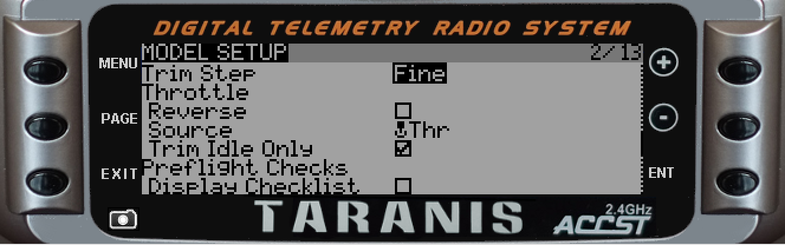
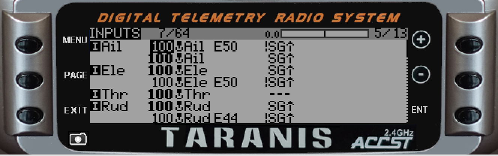
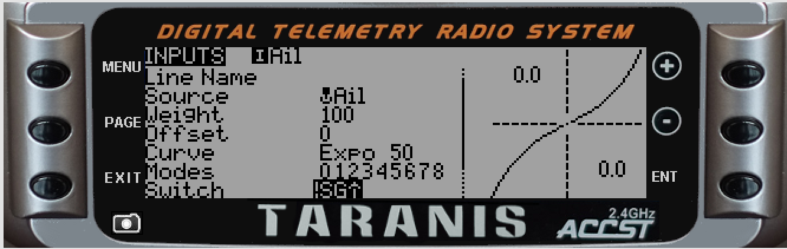
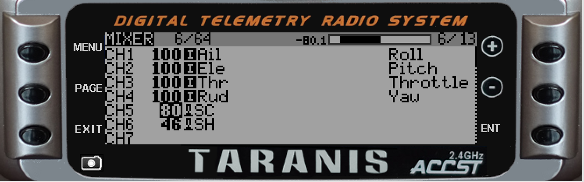

# Model Setup
This is the page to document model or receiver specific setup instructions.

The Deviation project (on which this project was based) have a useful list of models [here](http://www.deviationtx.com/wiki/supported_models).

# Syma X5C

## Channel Map

CH1|CH2|CH3|CH4|CH5|CH6|CH7|CH8|CH9
---|---|---|---|---|---|---|---|---
A|E|T|R|FLIP|RATES|PICTURE|VIDEO|HEADLESS

## Binding
There are no special binding instructions.  The model powers up in Autobind mode and expects the bind sequence from the transmitter within the first 4-5 seconds. 

## Tx Setup
A basic 4-channel setup works perfectly, but some improvements are possible:   

### Setting up a switch to Flip    

1. Choose your "Rates" switch - typically the momentary TRN switch
1. In the Mixer create an entry for CH5
1. Edit this line as follows:  
   - er9X: Source: sTRN, Weight 100 (or whatever switch you selected)
   - OpenTx: Source: SH, Weight 200 (or whatever switch you selected)
   
### Setting up a swich for high rates

1. Choose your "Rates" switch
1. In the Mixer create an entry for CH6
1. Edit this line as follows:  
   - er9X: Source: sTHR, Weight 100 (or whatever switch you selected)
   - OpenTx: Source: SF, Weight 200 (or whatever switch you selected)

When the switch is in the rear position the rates will be standard, when the switch is forward rates will be high.  There is no need to move the throttle stick to the full up and full down position as with the standard controller. 

### Setting up Idle-up
One of the most annoying functions on the Syma X5C is that the motors stop when the throttle is pulled back.  This can be fixed by implmenting Idle-up on the transmitter (think of this as a very simple version of the Betaflight "Air Mode").  Idle up will ensure that even when the throttle is all the way down, a minimum command is passed to the motor to keep them spinning and to activate the stabilization.  

**To do this**:   

1. Decide on a switch you will use to activate Idle up
1. In the mixer menu add a line under Throttle and mix in a value of between 4 and 6 to be added to the throttle value if the switch is activated.  What this does is effectively prevents the throttle from going down to less than this value.
1. When you want to fly in "idle-up" mode flick the switch and your stabilization will always be active.  
1. Remeber to switch off idle-up as soon as the quad lands (or crashes - to avoid damage to the motors)

### Additional notes on rates:

The SymaX driver can add full trim to the control output.  Doing so enables
dramatic rates, steep angles, and high speeds.  If CH6 is low, the usual Syma
full rates will be in effect.  If CH6 is high, the SymaX extreme trim rates will be
in effect.  Be cautious when first trying out the extreme rates.

The extreme rates do not work with with headless mode because in this
mode the trim and the primary control directions may not be aligned - the
primary control directions will be based on the headless mode, but the trims
remain based upon the quadcopter's heading.  So extreme rates are disabled
when headless mode is selected.

Be aware that the use of extreme rates and the resulting steep angles will
disorient the gyro responsible for maintaining headless mode, and that the
direction the quadcopter thinks you selected for headless mode may not be
correct after especially wild flights.

# Inductrix (Horizon Hobby)

## Binding
For telemetry enabled modules, you should just let the remote autodetect the settings. Otherwise choose DSMX 22ms with 6ch or 7ch. To bind the model, keep the transmitter off, power on the Inductrix. Wait until it flashes fast and then power up the Tx and use Bind.

### Throttle
For Inductrix FPV you might need to adjust the lower end of throttle to be a higher than default, otherwise motors will be spinning on minimal throttle.  One way to do this is to set the throttle to 80% output (100% of DSM output) and then to enable the **Throttle Idle Trim Only** under the Model Setup menu.  See image below:  

  

### Acro and Level Mode
Setup channel 6 with a momemtary button or switch (e.g. SH on the Taranis) and use that switch to switch between modes. Set the output to somewhere between 40% to 60% for best results.

An addition consideration when flying in Acro mode is to reduce stick sensitivity and to add some expo.  The screens below show one way of doing this.  Customize to your needs.

#### Inputs Screen   
The follwing INPUTS screen shows one potential setup to introduce expo for Acro mode.  The activation of the expo on Roll, Pitch and Yaw is when the SG switch is not in the back position.  Add to taste.

  

#### Aileron Rates attached to Switch !SG-up
The next screen shows and example of how the expo (50%) was set up on the stick input and how it is activated by !SG-up:  

  

#### Mixer Menu
The next screen shows the mixer menu with the mode change on momentary switch SH and High-Low rates on switch SC:  

  

# Cheerson CX-20 / Quanum Nova

## Channel Map

CH1|CH2|CH3|CH4|CH5|CH6|CH7
---|---|---|---|---|---|---
A|E|T|R|MODE|AUX1|AUX2

## Binding
The Rx powers up in binding mode so the transmitter should be set to autobind.  If the Tx signal is lost due to power-off or going out of range the Rx will not re-bind, and requires power-cycling before it will bind again.

## Tx Setup
AETR are simple +100% mixes.  Note that the model expects Elevator (CH2) to be reversed, which is handled in the module firmware, so no need to reverse it on the Tx.

### Flight modes
CH5 is used to transmit the flight mode to the APM flight controller by setting the output to a value in a pre-defined range.  The original Tx uses a 3-pos switch (SWA) and a 2-pos switch (SWB) to achieve six different combinations, but only five are used - with SWA at 0, 1500 is sent when SWB is at 0 and 1, leaving flight mode 3 unused.  However, in the stock CX-20 flight controller settings, both flight mode 3 and 4 are set to the same flight mode, meaning we can configure our new Tx settings to send a value for mode 3 without changing the standard flight mode behaviour.  Afterwards, you can optionally use Mission Planner to assign a new flight mode to mode 3 or mode 4, or reconfigure them altogether.

The values, modes, and switch positions for the stock Tx are:

Mode|Stock Tx PWM Value|CX-20 Mode|SWA|SWB
---|---|---|---|---
1|1100|Return to Home|2|0
2|1300|Altitude Sensor|2|1
3||||
4|1500|Manual|0|0 or 1
5|1700|Direction Lock|1|1
6|1900|Stable|1|0

**NB** The CX-20 uses flight mode names which are different to the standard APM flight mode names. The CX-20 modes map to APM modes as follows:

CX-20 Mode|APM Mode
---|---
Manual|Stabilize
Stable|Loiter
Direction Locked|Simple
Altitude Sensor|Altitude Hold
Return to Home|RTL (Return to Launch)

We need to set the Tx up to output these values on CH5 (or very similar values - more information, including the PWM width ranges is documented in the [Arducopter Wiki](http://ardupilot.org/copter/docs/common-rc-transmitter-flight-mode-configuration.html#common-rc-transmitter-flight-mode-configuration)).

One easy way to acheive this is to configure six logical switches mapped to two physical switches, for example the 3-way ID switch and the AIL D/R switch, then configure the logical switches to activate a flgiht mode and to apply a specific weight to the CH5 output.

To simply map the old Tx modes to the new Tx using the same switch positions, use the following configuration. The stock SWA switch is replaced with the ID0/1/2 switch, SWB is replaced with the AIL D/R switch.

#### Logical switches:

Switch|Function|V1|V2
---|---|---|---
L. Switch 1|AND|ID2|!AIL
L. Switch 2|AND|ID2|AIL
L. Switch 3|AND|ID0|!AIL
L. Switch 4|AND|ID0|AIL
L. Switch 5|AND|ID1|AIL
L. Switch 6|AND|ID1|!AIL

#### light modes (using CX-20 names):

Mode|Name|Switch
---|---|---
1|RTL|L1
2|AltSen|L2
3|Manual|L3
4|Manual|L4
5|DirLock|L5
6|Stable|L6

#### Mixer setup:

Channel|Weight|Source|Switch|Multiplex
---|---|---|---|---
CH5|-80%|HALF|L1|REPLACE
 |-40%|HALF|L2|REPLACE
 |-20%|HALF|L3|REPLACE
 |+0%|HALF|L4|REPLACE
 |+40%|HALF|L5|REPLACE
 |+80%|HALF|L6|REPLACE

**NB** The weight values in this table will get you in the ball park, and will most likely work fine.  Because transmitters can vary they should be double-checked in the Mission Planer Radio Calibration screen, and tweaked as necessary.

### CH6 and CH7
CH6 and CH7 can be assigned to switches or pots to provide additionaly functionality such as PID tuning, gimbal control, or APM auto-tune or auto-land.

Replicating the stock setup of two pots, you would assign:

Channel|Weight|Source|Multiplex
---|---|---|---
CH6|+100%|P1|ADD
CH7|+100%|P3|ADD

## Full Mixer Setup

Channel|Source|Weight|Switch|Multiplex
---|---|---|---|---
CH1|+100%|Aileron||
CH2|+100%|Elevator||
CH3|+100%|Throttle||
CH4|+100%|Rudder||
CH5|-80%|HALF|L1|REPLACE
 |-40%|HALF|L2|REPLACE
 |-20%|HALF|L3|REPLACE
 |+0%|HALF|L4|REPLACE
 |+40%|HALF|L5|REPLACE
 |+80%|HALF|L6|REPLACE
CH6|+100%|P1|
CH7|+100%|P3|

Once you have configured the mixes you should connect Mission Planner to your CX-20 and use the Radio Calibration screen to verify that the channels are correctly assigned, and that the flight modes are correct.  Mission planner will give the exact PWM value on CH5, allowing the weights to be adjusted if needed.

