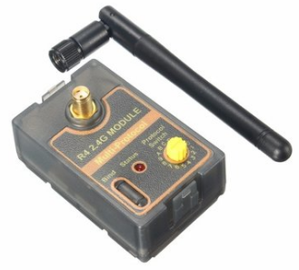
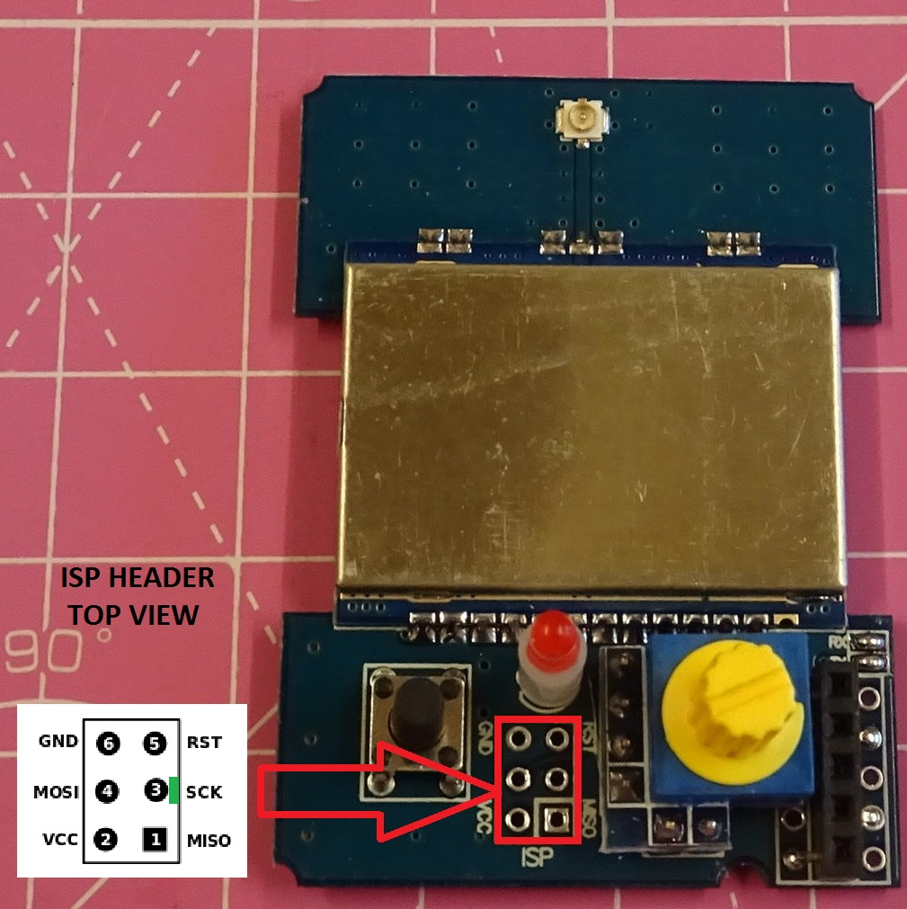
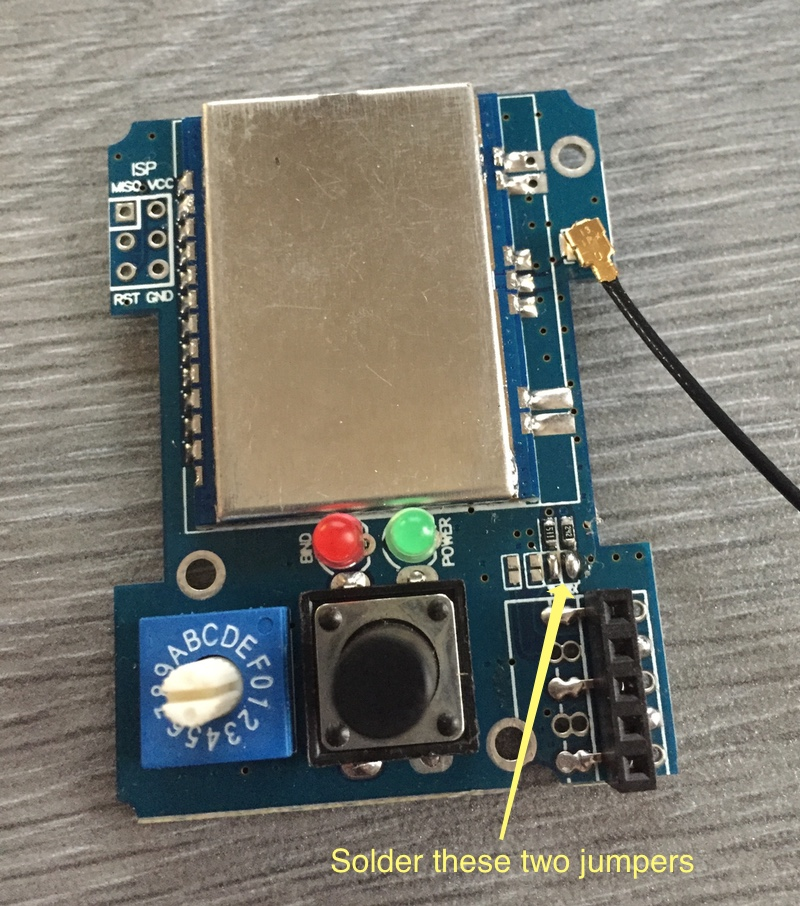
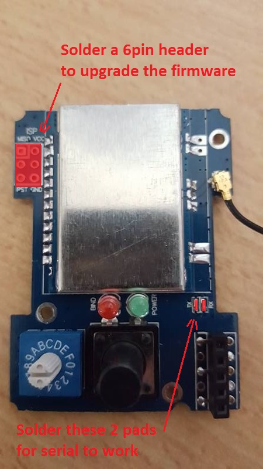

#4-in-1 Banggood module
Currently the form factor of this module is designed for the JR-style module bay. Many of the popular RC transmitters use the JR-style module bay: FrSky Taranis, FlySky Th9x, Turnigy 9X/R/Pro
##What you need
A fully assembled module + case available from Banggood.com [here](http://www.banggood.com/CC2500-NRF24L01-A7105-CYRF693-4-In-1-RF-Module-With-Case-For-Futaba-JR-Frsky-Transmitter-p-1116892.html)

 

Or

The ready-made module available from Banggood.com [here](http://www.banggood.com/2_4G-CC2500-A7105-Flysky-Frsky-Devo-DSM2-Multiprotocol-TX-Module-With-Antenna-p-1048377.html)  

 
Plus a module case that fits your module like the one [here](https://www.xtremepowersystems.net/proddetail.php?prod=XPS-J1CASE)  
   
  or you can 3D print your own from a selection on Thingiverse ([Example 1](http://www.thingiverse.com/thing:1852868) [Example 2](http://www.thingiverse.com/thing:1661833)).  
 

For 9XR/9XR Pro, a new 3D printed module is available which makes use of the built in antenna in the handle. This means nothing is getting out of the radio back! You can find all details of this module case on [thingiverse](http://www.thingiverse.com/thing:2050717).

  

##Different working modes

###PPM interface
If you are only planning on using the PPM interface with transmitter you are ready to program the module as described in Compiling and Programming the module.

###Enabling Serial and Telemetry interface
If you have a transmitter that can support serial communication with the board then you need to wire up the board appropriately. There are two versions of the module and the steps are slightly different.

Check which module you have and based on the pictures below.  If you purchased the module after June 2016 then it is likely that you have a V1.1 type module. If you have purchased the version with case it is likely that you have a V1.2 type module.

#### **Version 1.2 (V1.2) type modules** 

Serial is already enabled and ready to be used.
 
V1.2

 

#### **Version 1.1 (V1.1) type modules** 

Solder two bridges over the pads shown in the pictures below. 
 
V1.1a

 
 

V1.1b

 

V1.1c (also called 1.2)
This revision has a 1.2 printed on the board and replaces the 5V linear regulator with a swichting regulator. 

 

You are now ready to go over to [Compiling and Programming](Compiling.md).

#### **Version 1.0 (V1.0) module** 

Solder bridges and resistors as illustrated in the picture below.
 

You are now ready to go over to [Compiling and Programming](Compiling.md).
