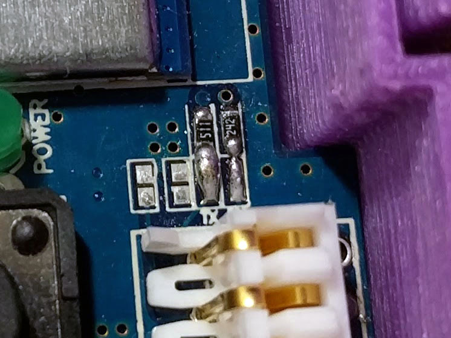
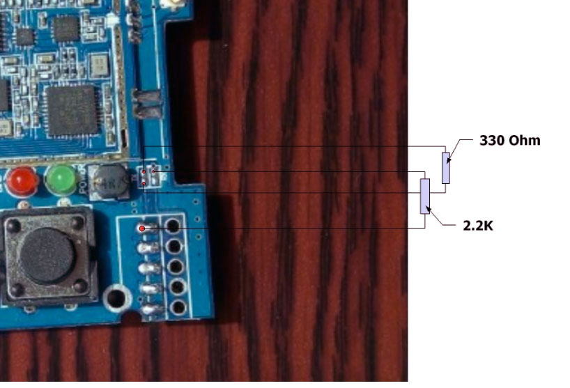

#4-in-1 Banggood module
Currently the form factor of this module is designed for the JR-style module bay. Many of the popular RC transmitters use the JR-style module bay: FrSky Taranis, FlySky Th9x, Turnigy 9X/R/Pro {other transmitters that come to mind?}
##What you need
1. The ready-made module is available from Banggood.com [here](http://www.banggood.com/2_4G-CC2500-A7105-Flysky-Frsky-Devo-DSM2-Multiprotocol-TX-Module-With-Antenna-p-1048377.html)  
  
1. A module case that fits your receiver like the one [here](https://www.xtremepowersystems.net/proddetail.php?prod=XPS-J1CASE)  
  
  or you can 3D print your own from a selection on Thingiverse (example [here](http://www.thingiverse.com/thing:1661833)). 
  
1. 3x2 header pins (to solder onto the board for programming) 
1. AVR ISP programmer like the popular USBASP programming dongle that is 3.3V safe - available from many sellers on [ebay.](http://www.ebay.com/sch/i.html?_odkw=usbasp+progammer&_osacat=0&_from=R40&_trksid=p2045573.m570.l1313.TR3.TRC2.A0.H0.Xusbasp+progammer+3.3V.TRS1&_nkw=usbasp+progammer+3.3V&_sacat=0)  There are reports that some of the cheap programmers are not safe to use with 3.3V units (like this unit).  Look for USBAsp programmers with the “LC Technologies” label. {Pascal to confirm these reports are true} Also, you will need a 10-pin to 6-pin connector to connect the USBASP to the board. 

##Build instructions
The assembly process is trivial but it does depend on:
- The communication interface between your transmitter and the module, and
- The version of the module you have

###Common steps

1. Solder the 3x2 header pins onto the module as shown below {insert picture of module with pins}.  These header pins are required to program the microcontroller. 
1. Fit the module into the module case. This may require some careful filing or sanding of the module to ensure a nice fit.

###PPM interface
If you are only planning on using the PPM interface with transmitter you are ready to program the module as described in Compiling and Programming the module.

###Enabling Serial interface
If you have a transmitter that can support serial communication with the board then you need to wire up the board appropriately. There are two versions of the module and the steps are slightly different.

Check which module you have and based on the pictures below.  If you purchased the module after June 2016 then it is likely that you have V2 module.  

#### **Version 2 (V2) module** 

Solder two bridges over the pads shown in the picture below. 
 
 
 

You are now ready to go over to [Compiling and Programming](Compiling.md).

#### **Version 1 (V1) module** 

Solder bridges and resistors as illustrated in the picture below.
 

You are now ready to go over to [Compiling and Programming](Compiling.md).
