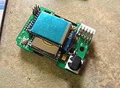
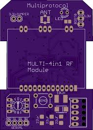
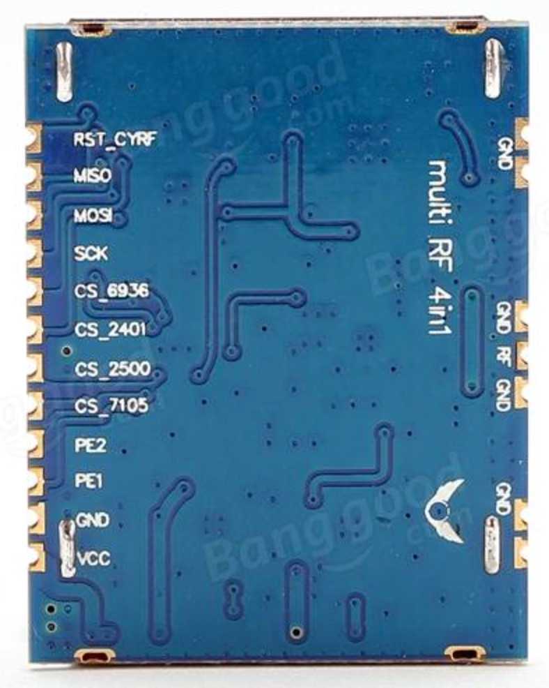
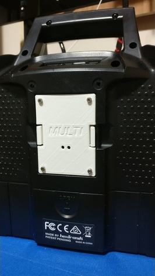
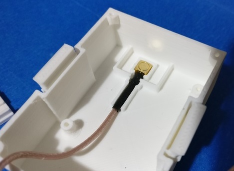
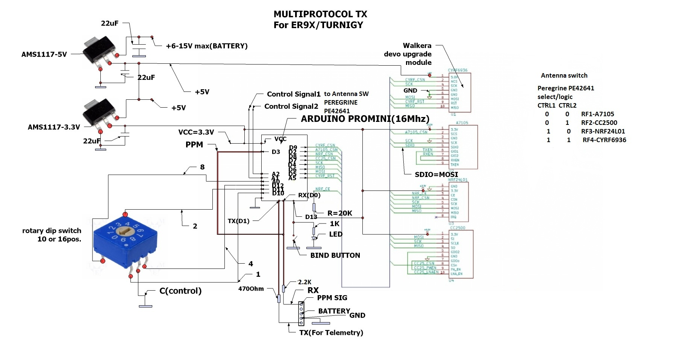

# DIY MULTI-module by soldering components on a PCB
Currently the form factor of this module is designed for the JR-style module bay. Many of the popular RC transmitters use the JR-style module bay: FrSky Taranis, FlySky Th9x, Turnigy 9X/R/Pro

## What you need
First you must choose the PCB onto which to solder all the components. There are two PCB options:
- ATmega (8-bit) powered PCB V2.3d supporting individual RF modules
- STM32 (32-bit) powered PCB V1.0t supporting the 4-in-1 RF module

The **ATmega-based board** has been designed to accept individual RF modules.  This way you can select just the module or modules you want.  The downside is that each module requires its own antenna.  It can become cumbersome with 4 antennas protruding from the module.  It is possible to soder the 4-in-1 module to the PCB using thin insulated wire. This 4-in-1 module requires only one antenna.  Finally, the Atmega board has a 32KB flash memory.  This is big enough to accommodate more than 15 protocols, but it cannot accommodate all the available protocols.



The **STM32-based** board has been designed to accept the 4-in-1 RF module with the antenna switcher (shown below). This means only one antenna.  The STM32F103 processesor also has a much larger flash memory. 

   

### ATmega board V2.3d
1. ATmega (8-bit) powered PCB V2.3d available from OSHPark [here](https://oshpark.com/shared_projects/Ztus1ah8).
2. Individual RF modules  The modules are available here:
    - [CC2500](http://www.banggood.com/2_4G-500K-CC2500-Long-Range-Wireless-Transceiver-Module-p-1075492.html) for FrSkyV, FrSkyD, FrSkyX and SFHSS
    - CYRF6936 for DSM, DEVO, J6Pro ([here](http://www.trade4me.de/Devo-WK-21201RF-2-4GHZ-Telemetrie-Modul::34960.html), [here](http://www.walkeraonline.com/walkera-wk-devo-s-mod-devo-8-or-12-to-devo-8s-or-12s-upgrade-module.html), or [here](http://www.buychina.com/items/2-4g-module-cyrf6936-pa-lna-module-cyrf6936-20dbm-module-uuruunslkhi)
    - [A7105](http://www.banggood.com/A7105-Wireless-RF-2_4GHz-Transceiver-Module-3_3V-Power-Supply-Module-p-909404.html) for Flysky, Hubsan
    - [NRF24L01](http://www.banggood.com/2_4G-NRF24L01-PA-LNA-Wireless-Module-16+32mm-Without-Antenna-p-922601.html?utm_source=tradetracker&utm_medium=tradetracker_SE&utm_campaign=tradetracker&utm_content=227736) for Hisky, V2x2, CX-10, SYMAX and plenty other protocols
    - The 4-in-1 RF module (available [here](http://www.banggood.com/DIY-2_4G-CC2500-NRF24L01-A7105-CYRF6936-Multi-RF-4-IN-1-Wireless-Module-p-1046308.html)) can also be connected with solder wires.  To enable the antenna switcher the PE1 and PE2 pads must be soldered to ATmega pins, check the [schematic](#V23D_Schematic)  
1. Electronics component BOM is [here](BOM_DIY_ATmega.md).  This BOM is inclusive, you many not need all the parts depending on your needs.

The schematic for the board is [here](#V23D_Schematic).  Please note that is is the general schematic - there will be some minor differences (like solder jumpers) between this and the board.

### STM32 powered PCB
1. The latest STM32 (32-bit) powered PCB V1.0t supporting the 4-in-1 RF module available from OSHPark [here](https://oshpark.com/shared_projects/GX51nEoH).  
2. The 4-in-1 RF module is available [here](http://www.banggood.com/DIY-2_4G-CC2500-NRF24L01-A7105-CYRF6936-Multi-RF-4-IN-1-Wireless-Module-p-1046308.html) 
1. The schematic and BOM for this board V1.0t and older boards are available [here](BOM_DIY_STM32%20\&%20Schematic.md).

### Common parts
1. A module case that fits your module like the one [here](https://www.xtremepowersystems.net/proddetail.php?prod=XPS-J1CASE) <br>  <br> or you can 3D print your own from a selection on Thingiverse ([Example 1](http://www.thingiverse.com/thing:1852868) [Example 2](http://www.thingiverse.com/thing:1661833)). <br> [ ](http://www.thingiverse.com/thing:1852868) <br> For 9XR/9XR Pro, a new 3D printed module is available which makes use of the built in antenna in the handle. This means nothing is getting out of the radio back! You can find all details of this module case on [Thingiverse](http://www.thingiverse.com/thing:2050717). <br>   
1. A 2.4GHz antenna and pigtail

## Build instructions
If you got this far you already know what you are doing!!

### Common steps

1. Solder all the parts according to the BOM part numbering and the images for your board (see OSHPARK for the images)
1. Fit the module into the module case. This may require some careful filing or sanding of the module to ensure a nice fit.

### PPM interface
If you are only planning on using the PPM interface with transmitter you are ready to program the module as described in [Compiling and Programming](Compiling.md) the module.

### Enabling Serial and Telemetry interface
If you have a transmitter that can support serial communication with the board then you need to solder some jumpers.


#### **ATmega V2.3d board** 

There are four solder type jumpers on the bottom side of the board near the lower left corner when the bottom of the board is facing towards you. The silkscreen shows which jumper is which. These four jumpers enable the board to be configured in several ways as explaned below.
```
	(J-1)	Use (PPM V/V) if the incoming PPM signal is at a higher voltage level, leave open if ~~5V.
	(J-2)	Use (Jumper 2) to connect the incomming PPM signal to the RX pin on the processor
	(J-3)	Short (TELEM) only if you have done a telemetry mod to your radio, leave open if not needed. When connected, pin 2 of the two pin header (P3) is also connected.
	(J-4)	Use (MOD) only to connect the transmitter pin 2 to pin 1 of the two pin header (P3).
```

**It is most likely J-2 will be the only one needing to be shorted for the serial method of sending model protocols.  If you plan to use telemetry you will also need to solder J-3**

You are now ready to go over to [Compiling and Programming](Compiling.md).

#### **STM32 board** 

You are now ready to go over to [Compiling and Programming STM32](Compiling_STM32.md).

# Reference Schematic <a name="Schematic"></a>
Here is the schematic you can use to troubleshoot the module
##  <a name="V23D_Schematic"></a> PCB 2.3d Schematic
General module schematic (reference)
 
V2.3d Board Schematic
 

## <a name="STM32_Schematic"></a> PCB STM32 V1.0t Schematic
 
