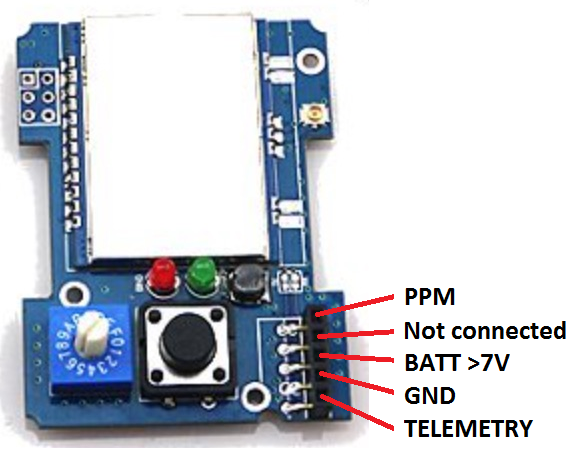
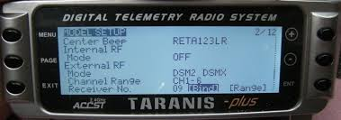
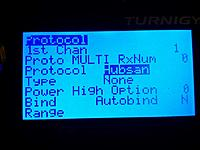

# Compatible Transmitters

There are two different modes to interface the MULTI-Module and the transmitter: PPM and Serial. The considerations are different for each.
- **PPM** is more generic, easy to implement and will work with most transmitters. 
- **Serial** requires custom firmware on the transmitter but brings added functionality including protocol selection through the Tx interface and the option of telemetry (with the right transmitter firmware).

Any Tx providing a PPM output (like a trainer port, or a transmitter with a RF module bay) is compatible with the MULTI-module.

## PPM
The DIY Mulitprotocol module supports industry standard PPM interface that works with all transmitters with either a module bay, and/or a trainer port.  Even the older 72MHz FM radios support this standard.

 

The same module plug is available on all versions of the module with the same signal locations. Some radios have an open collector output (Futaba, Graupner...), in this case you should add a 4.7K resistor between PPM and BATT.

When using the standard PPM Tx output, the protocol selection is achieved through a 16 position rotary switch on the module and a bank system. This enables up to 70 protocol/sub-protocol/options combinations to be selected when using 5 banks.  Binding is achieved by pressing a bind button on the back of the module (see picture below) 

Since the module supports literally hundreds of protocol/sub-protocol/options combinations, you must select which of these will map to the bank + positions on the switch.  Refer to the [Compiling and Programming](Compiling.md) page for information on how to do his.

Even in PPM mode it may still be possible to access telemetry information from selected receivers that support telemetry (e.g. Frsky, Hubsan, DSM).  To find out more about this advanced option check out the section on the [Advanced Topics](Advanced_Topics.md) page.  

For transmitter setup using the PPM protocol go to the [PPM Setup page](PPM_Setup.md)

## Serial
Transmitters that run er9X, erSky9X or OpenTx firmwares (like the FrSky Taranis, FlySky TH9X and Turnigy 9X family of transmitters) have the option of using a fast serial communication protocol between the Tx and the DIY Multiprotocol module by placing the rotary switch to position 0 (independently of the banks).  Using this serial communication protocol has some significant advantages:

1. selecting the specific radio protocol (e.g. DSM) and the sub protocol (e.g. DSMX22) is done directly in the menu system of the Tx (see the picture below) 
1. binding through the menu on the Tx 
1. range checking through the menu on the Tx 
1. in some cases enabling two-way serial communication for telemetry capable receivers/models. 

  

This serial protocol does not require any hardware modifications, but **will** require updating the firmware on your radio. Transmitters and firmware combinations that support the Serial protocol are shown in the table below. Also shown are telemetry considerations that will be discussed next.  

Transmitter|Firmware Options|Telemetry Enabled
:----------|:---------------|:----------------
[FrSky Taranis X9D/X9D+/9XE](Tx-Taranis.md)| erSky9x, OpenTx 2.1.9 Multi, OpenTX 2.2 (multimodule option)|Yes - native
[Frsky Taranis Q X7/Horus](Tx-Taranis.md)| ersky9x, OpenTX 2.2 (multimodule option)| Yes - native
[Turnigy 9X/9xR](Tx-FlyskyTH9X.md)|er9x|[Mod required](#Telemetry_Mod)
[Turnigy 9XR-Pro](Tx-erSky9X.md)|erSky9x|Yes - native
[FlySky TH9x](Tx-FlyskyTH9X.md)|er9x|[Mod required](#Telemetry_Mod)
[SKY board](Tx-erSky9X.md)|erSky9x|Yes - native
[AR9X board](Tx-erSky9X.md)|erSky9x|Yes - native
[9Xtreme board](Tx-erSky9X.md)|erSky9x|Yes - native
[AR9X UNI board](Tx-erSky9X.md)|erSky9x|Yes - native

Click on your transmitter above to view specific setup instructions.

## Telemetry  

To enable serial telemetry you need one of the radios and firmwares listed in the table above and **may** require modifications to your Tx. See the table above.  Before attempting telemetry check the following:  

1. Your module has the appropriate connections or solder jumpers to connect the TX pin of the MCU to pin 5 on the module.  Check the documentation by selecting your module on this [page](Hardware.md) and reviewing the Telemetry section
1. You have the correct firmware to allow serial communcation between the transmitter and the MULTI-Module.  Check the table above.
1. Your transmitter hardware is telemetry enabled, or you have done the required mods.  Check the table above.

   
## Optional Telemetry mod for 9X/R TH9X transmitters
The telemetry mod for these transmitters has evolved.  The original and popular "FrSky Telemetry Mod" requires 2 pins on the transmitter module board to be modified (RX on pin 5 and TX on pin 2).  All the recent MULTI-Module hardware options supports serial transmission on pin 1 (the same pin as the PPM signal) so, in this case, only the mod on pin 5 is required. 

A good tutorial to follow is Oscar Liang's [here](http://blog.oscarliang.net/turnigy-9x-advance-mod/) but when you get to wiring up the Tx Module bay pins, you only need to perform the steps relevant for Pin 5.

You can see Midelic's original instructions [here](http://www.rcgroups.com/forums/showpost.php?p=28359305&postcount=2)  

## Other Notes:  

- Owners of Walkera Devo transmitters should look at the [Deviation-Tx](http://www.deviationtx.com) project for how to achieve the same end goal with your transmitters. 

- To enable telemetry on a Turnigy 9X or 9XR you need to modify your TX [read this.](#Telemetry_Mod).

- Once the TX is telemetry enabled, it just needs to be configured on the model (see er9x/ersky9x documentation).
