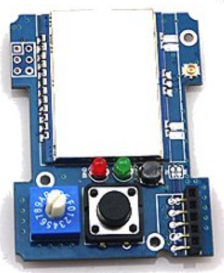

# Compatible Transmitters

Any Tx that provides a PPM output (like a trainer port, or a RF module bay) is compatible with the DIY Multiprotocol module.  In practice, most of the documentation on this site is focused on building modules that slip into your transmitter’s module bay. 
{insert picures of different modules}
 
There are two different options for the interface between the Mulitprotocol Module and the transmitter: PPM and Serial. The considerations are different for each.
- **PPM** is more generic, easy to implement and will work with most transmitters. 
- **Serial** requires custom firmware on the transmitter but brings added functionality including telemetry and protocol selection through the Tx interface

##PPM
The DIY Mulitprotocol module supports industry standard PPM interface that works with all transmitters with either a module bay, and/or a trainer port.  Even the older 72MHz FM radios support this standard.

When using the standard PPM Tx output, the protocol selection is achieved through a 16 position rotary switch on the module. This enables 15 protocol/sub-protocol/options combinations to be selected.  Binding is achieved by pressing a bind button on the back of the module (see picture below) 

 

Since the module supports literally hundreds of protocol/sub-protocol/options combinations, you must select which of these will map to the 15 positions on the switch.  Refer to the [Compiling and Programming](Compiling.md) page for information on how to do his.

Telemetry is available as a serial 9600 8 n 1 output on the TX pin of the Atmega328p using the FrSky hub format for Hubsan, FrSkyD, FrSkyX and DSM format for DSM2/X.

You can connect it to your TX if it is telemetry enabled or use a bluetooth adapter (HC05/HC06) along with an app on your phone/tablet ([app example](https://play.google.com/store/apps/details?id=biz.onomato.frskydash&hl=fr)) to display telemetry information and setup alerts.

For transmitter setup using the PPM protocol go to the [PPM Setup page](PPM_Setup.md)

##Serial
Transmitters that run er9X, erSky9X or OpenTx firmwares - like the FrSky Taranis and FlySky TH9X/Turnigy 9X/R family of transmitters - have the option of using a fast, two-way serial, communication protocol between the Tx and the DIY Multiprotocol module.  Using this serial communication protocol has some significant advantages:

1. selecting the specific radio protocol (e.g. DSM) and the sub protocol (e.g. DSMX) directly in the menu system of the Tx (see the picture below) 
1. binding through the menu on the Tx 
1. range checking through the menu on the Tx 
1. enabling two-way telemetry for telemetry capable receivers and protocols. 

  

This serial protocol does not require any hardware modifications, but **will** require updating the firmware on your radio. 

Transmitters and firmware combinations that support the Serial protocol are:

{Can someone check the transmitters click through to the right pages?  How should the "erSky9x" boards be handled? A separate Tx- page or a link to the Taranis page?}

Transmitter|Firmware Options
:----------|:-------
[FrSky Taranis/Plus/9XE](Tx-Taranis.md)| [erSky9x](http://www.er9x.com), [OpenTx 2.1.8 Multi](http://plaisthos.de/opentx/)
[Turnigy 9X/9xR](Tx-FlyskyTH9X.md)|[er9x](http://www.er9x.com)
[Turnigy 9XR-Pro](Tx-Taranis.md)|[erSky9x](http://www.er9x.com)
[FrSky TH9x](Tx-FlyskyTH9X.md)|[er9x](http://www.er9x.com)
SKY board|[erSky9x](http://www.er9x.com)
AR9X board|[erSky9x](http://www.er9x.com)
9Xtreme board|[erSky9x](http://www.er9x.com)
AR9X UNI board|[erSky9x](http://www.er9x.com)

Click on your transmitter above to view specific setup instructions.

Other Notes: 
- er9X and erSky9X firmware already supports Multiprotocol Module as a standard feature.  At time of writing it looks like that the next major release of OpenTx - OpenTx 2.2 - will have DIY Mulitprotocol support as a standard feature.  

- Owners of Walkera Devo transmitters should look at the [Deviation-Tx](http://www.deviationtx.com) project for how to achieve the same end goal with your transmitters. 

