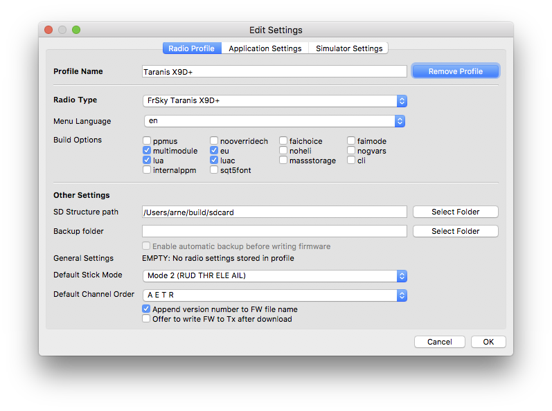
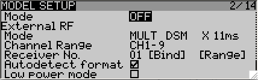
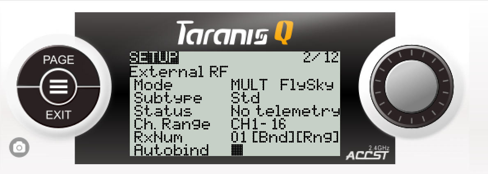
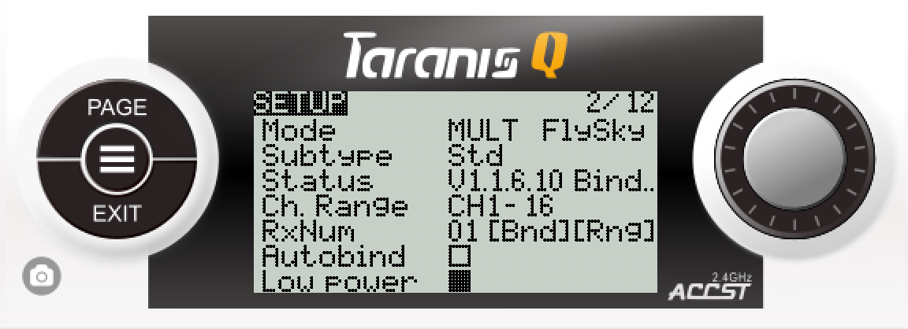

# FrSky Taranis/Horus Setup
This page contains setup instructions for the FrSky family of transmitters. These include the Trananis X9D, Taranis X9D Plus, Taranis X9E and Horus X12S.  It may also be relevant to the following transmitters: Turnigy 9XR Pro, Sky board-based, AR9X board-based, 9Xtreme board-based and AR9X Uni board-based, for these the OpenTX is implemented but currently untested.  


The instructions below are relevant to the following firmwares:
 1. Taranis with erSky9X available [here](http://www.er9x.com)
 1. Taranis/Horus with OpenTX 2.2 and multimodule option enabled [here](http://www.open-tx.org/)
 1. Taranis with OpenTx available [here](http://plaisthos.de/opentx/), outdated use OpenTX 2.2

If you use OpenTX Version 2.2 RC9 or later is strongly recommended as earlier version had a bug that scaled -100;100% output to -125%;125% output.

The MULTI-module can be used with all transmitters and firmwares in PPM mode.  Taranis transmitters running erSky9X or OpenTX (Version 2.1.9 Multi or Version 2.2) fully support Serial mode. 
## PPM Mode
Please refer to the [PPM Setup](PPM_Setup.md) page. 

## Serial mode
### Enabling Serial Mode
To operate in serial mode, you need one of these firmwares:
1. erSky9x Revision 218 or later - the hex files are available [here](http://www.er9x.com) (Mike's latests test versions are available [here](http://openrcforums.com/forum/viewtopic.php?f=7&t=4676)).
1. OpenTx supporting the MULTI-Module (Version 2.1.8 Multi or later, 2.2 recommended). Check and upload a supported firmware.  The latest available version at time of writing are:
   - OpenTx 2.2RC16 or later  [www.open-tx.org](http://www.open-tx.org/)
   - Please make sure that the "multimodule" option in OpenTX Companion is checked: <br>  <br>

Tutorials for uploading new firmware using the SD Card are available [here](http://www.dronetrest.com/t/how-to-upgrade-firmware-for-frsky-taranis-x9d/959) or the CompanionTx or eepe software (recommended) are available [here](http://open-txu.org/home/undergraduate-courses/fund-of-opentx/part-2-flashing-opentx/). 

**Note: In these tutorials, substitute the firmwares from the links to the supported firmwares above.**

First, confirm that the MULTI-Module has the required physical connections between the pins on the back of the Tx and the ATMega328 microprocessor.  This may require some soldering and depends on which version of the DIY Multiprotocol module you have.  Check out the specific pages for your module hardware (under the section "Enabling Serial") linked [here](Hardware.md) for details.

1. Plug in your MULTI-Module into the transmitter's module bay.  
1. If you have a rotary protocol selection switch, turn the switch to position 0 to put the unit into Serial mode. 
1. Ensure throttle is down and all switches are in the start position and power up the Transmitter.  The red LED on the MULTI-Module should be flashing with a period of about 1s indicating that it has not established a valid serial link with the Tx.  This is expected as we have not set up the Tx yet.
1. Create a new model (make sure channel order is AETR - **This is really important - this is for all protocols - even for DSM as the MULTI-module firware will change the transmitted channel order according to the protocol.**) and on the first Model Settings page scroll down to disable the internal RF and enable the external RF by selecting MULTI as the external RF. Your Transmitter settings should look like this: <br>  <br> or <br>  <br> The Red LED on the MULTI-Module should briefly flash and then stay on.  This confirms that the MULTI-Module module has established serial communication with the Tx.  
1. If the red LED on the module continues to flash at a period of about 1s then it signals that serial communication has not been established.  Check your settings under the model menu as described above and check that the protocol selection switch on the module is at 0 (zero).  If there is still no communication, power down and power up the Tx.  Finally check that you have correctly enabled your module for serial as described in specific pages for your module hardware (under the section "Enabling Serial") linked [here](Hardware.md)
 
### Protocol Selection in Serial mode
To select the protocol, scroll through the available options under the Model Settings menu.  Depending on which protocol you have selected you may be required to select a sup-protocol and options.  For example, the FrSky protocol has three sub-protocols FrSkyV, FrSkyD and FrSkyX.  Each of the sub-protocols may have options that specify the number of channels and the packet frame rate, etc.  

The following picture shows DSM – DSMX – Option 6 (6 channels and 11ms frame rate). Check out the [Protocol Details](Protocol_Details.md) page for detailed information and suggestions regarding the sub-protocols and options.

### Protcol Status in Serial mode (OpenTX)
If you see ```NO MULTI_TELEMETRY``` or no ```NO TELEMETRY``` in the setup screen of the external module, like this: <br>  <br> you are missing the ```MULTI_TELEMETRY``` and/or ```INVERT_TELEMTRY``` option in your ```_Config.h``` and/or [you need to hardware modifications to enable telemetry](Hardware.md). OpenTX also shows the ```NO TELEMETRY``` message if no module status has been received in the last 2s which can indicate a non working module if the telemetry status worked before.  With the option enabled, the right telemetry type is automatically detected and you will see the status of the module: <br>  <br> (Selected protocol is not available, most probably mssing from ```_Config.h```) <br>  <br> (Module is currently binding and code on the module is running V1.1.6.10)


### Binding in Serial mode
1. Switch on the model or put the receiver into bind mode
1. On the transmitter go to the Model Settings menu and scroll down to the [Bind] menu option and press Enter.
1. Press Enter again to exit Bind mode

For many consumer models consider checking the Autobind option.  This will initiate the bind sequence as soon as the module is powered up by the transmitter.

If you are struggling to get a bind please see the [Getting the bind timing right page](Bind_Timing.md)
